# Architecture Diagrams — Amazon ML Challenge 2026 Business Entity Resolution

> Companion to `amazon_ml_challenge_master_architecture.md`. All Mermaid diagrams collected in one
> place for rendering. Diagrams are authored with quoted labels and ` ` breaks for reliable
> `mmdc` (mermaid-cli) rendering. Status markers: ✅ Existing · 🟡 In progress · ⬜ Planned.
> Labels: [ORG] organizer · [PDD] project decision · [ENG] engineering · [EXP] experimental · [FUT] future.

## Index
1. D1 — Overall system architecture
2. D2 — Data ingestion + integrity
3. D3 — Candidate generation (four passes)
4. D3b — Candidate ranking + pruning (frozen policy v1)
5. D4 — Data split / leakage firewall
6. D5 — Feature engineering (pair → 65-d)
7. D6 — Negative sampling from candidates
8. D7 — Matcher (candidate → calibrated probability)
9. D8 — S1-level decision policy
10. D9 — Resource / partition strategy
11. D10 — Reproducibility / artifact chain
12. D11 — Training pipeline (build-time)
13. D12 — Test / inference pipeline
14. D13 — Submission / validation
15. D14 — Evaluation layers (L1–L4)

---

## D1 — Overall system architecture

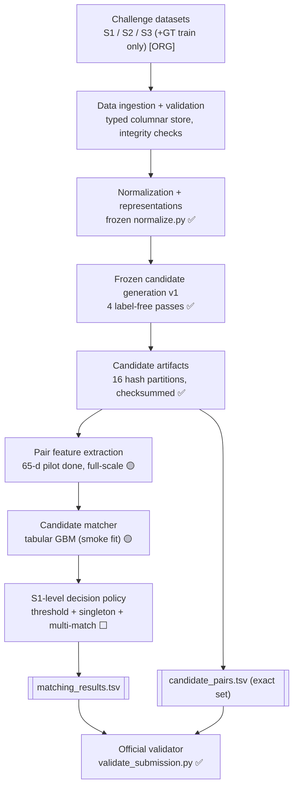

## D2 — Data ingestion + integrity

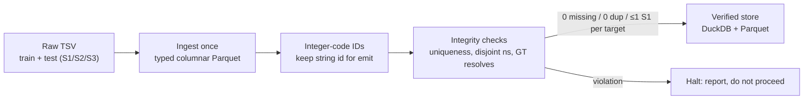

## D3 — Candidate generation (four passes → union → rank)

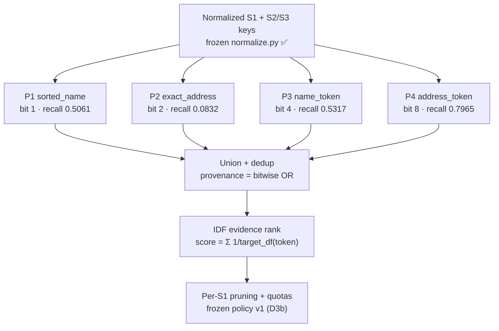

## D3b — Candidate ranking + pruning (frozen policy v1)

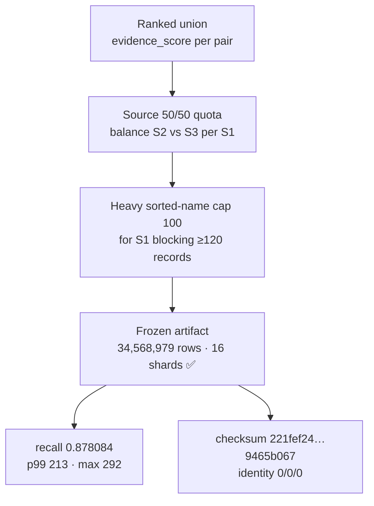

## D4 — Data split / leakage firewall

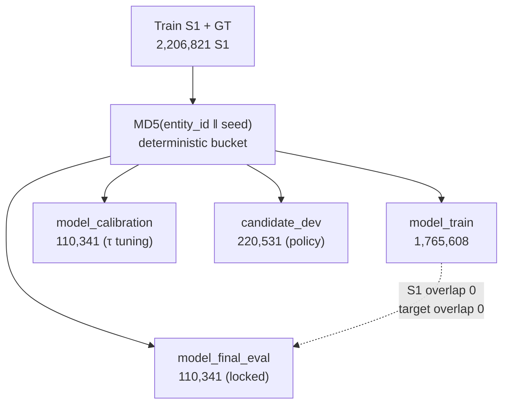

## D5 — Feature engineering (pair → 65-d vector)

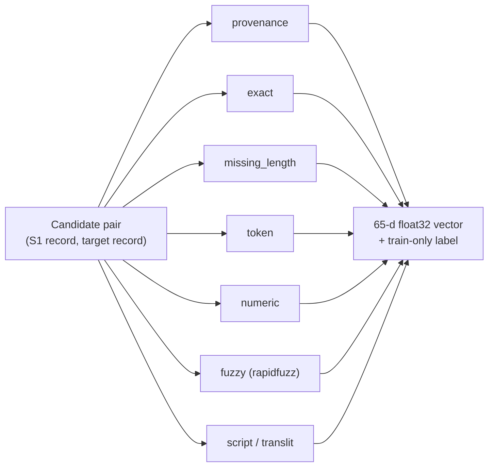

## D6 — Negative sampling from candidates

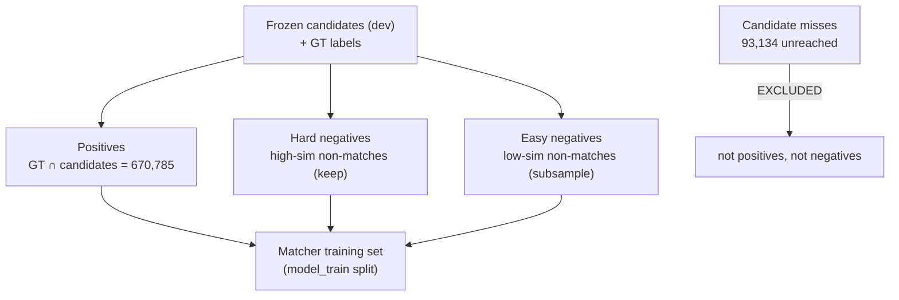

## D7 — Matcher (candidate → calibrated probability)

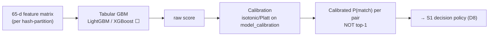

## D8 — S1-level decision policy

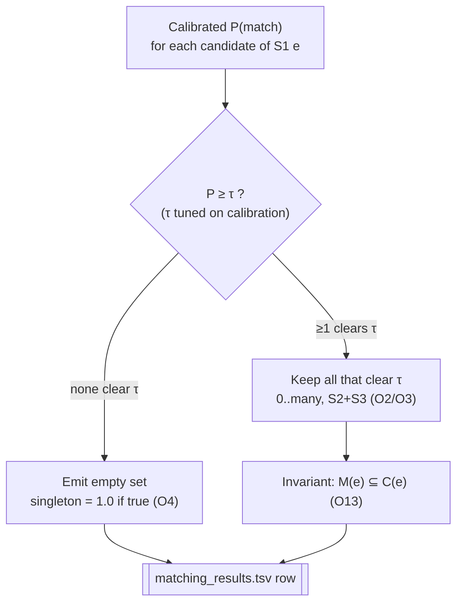

## D9 — Resource / partition strategy

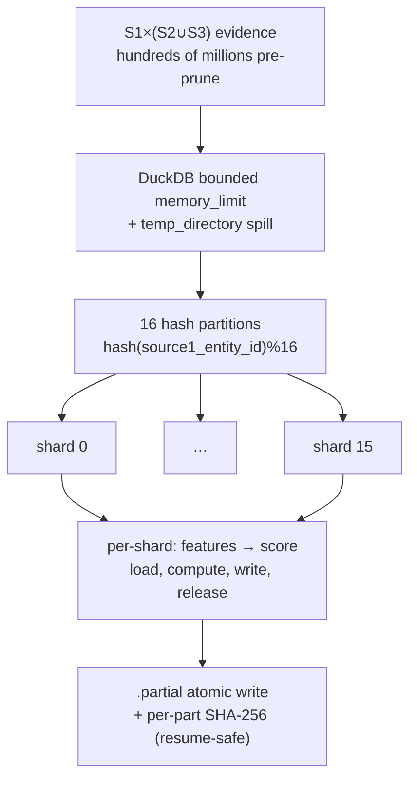

## D10 — Reproducibility / artifact chain

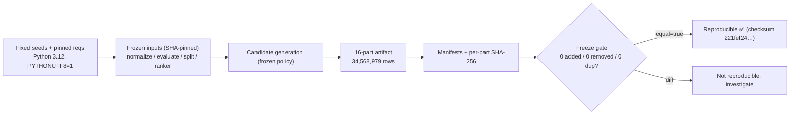

## D11 — Training pipeline (build-time)

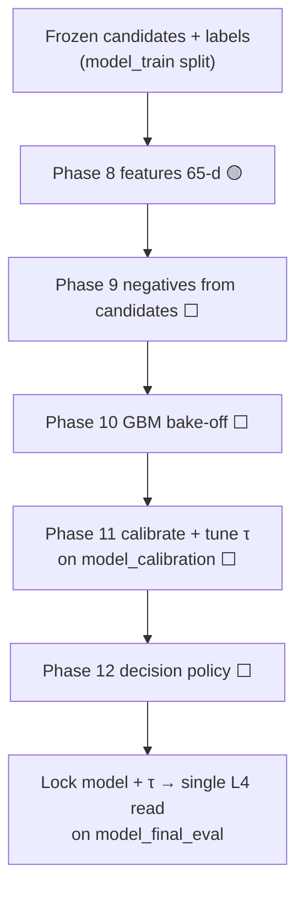

## D12 — Test / inference pipeline

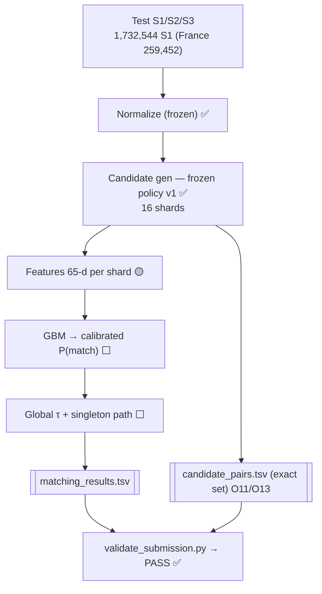

## D13 — Submission / validation

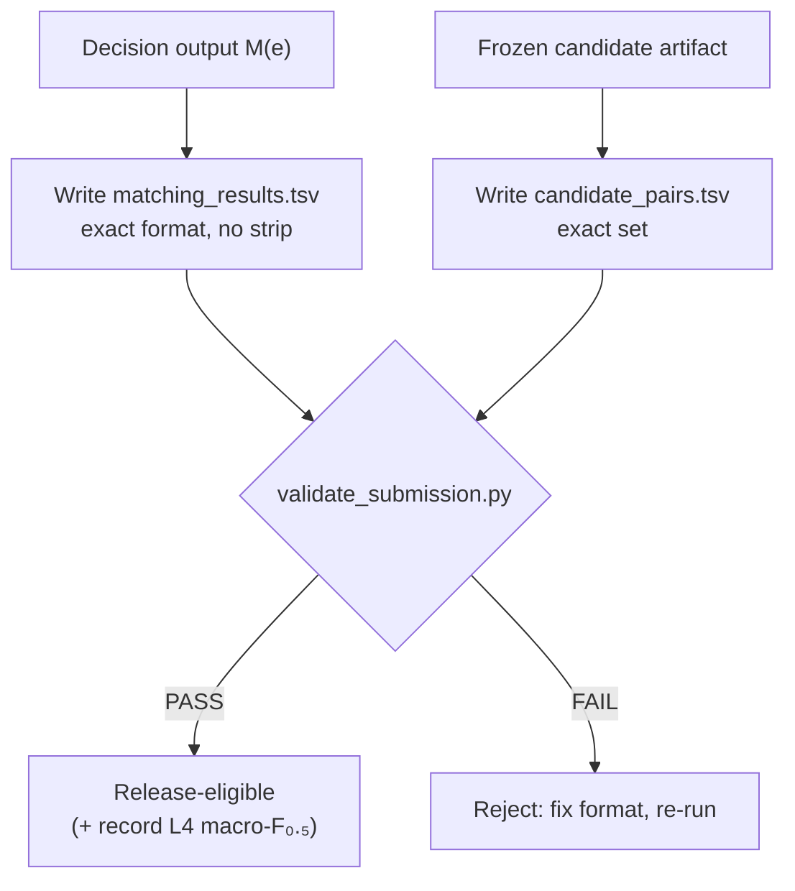

## D14 — Evaluation layers (L1–L4, never conflated)

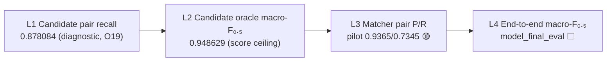

---

*14 diagrams. D1–D14 cover: overall system, data ingestion, candidate generation, candidate
ranking/pruning, split/leakage, feature engineering, negative sampling, matcher, S1 decision,
resource/partition, reproducibility/artifact, training pipeline, test/inference, submission/validation,
and evaluation layers — the full mandated set plus data-ingestion, negative-sampling, and
evaluation-layer diagrams. Source of truth for all figures: the frozen manifests and reports cited in
`amazon_ml_challenge_master_architecture.md`.*
