# Master Technical Architecture & Implementation Blueprint
## Amazon ML Challenge 2026 — Business Entity Resolution

> **Canonical editable source.** Generated 2026-09-26. Single source of truth for implementation.
> Derived strictly from (a) the official problem statement (`ProblemStatement.txt` / `CHALLENGE.md`),
> (b) the current repository state, and (c) the **frozen** candidate-generation design
> (`evidence_source_50_50_heavy100_v1`). No organizer requirement, dataset fact, benchmark number, or
> repository component is invented; every figure is traceable to a cited artifact. Where the repository
> conflicts with the brief, the discrepancy is reported (see §11, §32), not silently resolved.

### Labeling legend
Every architectural element is tagged:
- **[ORG]** *Organizer Requirement* — mandated by the problem statement / validator.
- **[PDD]** *Project Design Decision* — a deliberate choice by this project.
- **[ENG]** *Engineering Constraint* — forced by environment (RAM, OS, licenses).
- **[EXP]** *Experimental Decision* — chosen because a logged experiment supports it.
- **[FUT]** *Future/Optional Enhancement* — planned/optional; not yet built.

### Build-status legend
- **✅ Existing** — code + artifact present and verified. **🟡 In progress** — scaffold/contract only,
  computation not implemented. **⬜ Planned** — described in plan docs only; no code yet.

---

## Table of Contents
1. Executive Summary
2. Challenge Overview
3. Official Requirements
4. Requirement-to-Architecture Traceability
5. Problem Definition
6. System Goals and Non-Goals
7. Data Architecture
8. Data Schemas
9. Normalization Architecture
10. Candidate Generation Architecture
11. Frozen Candidate Policy v1
12. Candidate Oracle and Quality Ceiling
13. Matcher Split Architecture
14. Feature Architecture
15. Negative Sampling Architecture
16. Matcher Architecture
17. Entity-Level Decision Architecture
18. Evaluation Architecture
19. Resource and Scalability Architecture
20. Reproducibility Architecture
21. Experiment Tracking
22. Repository Architecture
23. Technology Stack
24. End-to-End Implementation Plan
25. Final Production Pipeline
26. Submission Architecture
27. Failure Modes and Safeguards
28. Security / Data Governance Constraints
29. Architecture Decision Records
30. Requirement Traceability Matrix
31. Current Project Status
32. Future Extensions
33. Final Architecture Summary

---

## 1. Executive Summary

This project resolves business entities across **three noisy sources**. **Source 1 (S1) is the
deduplicated reference [ORG]** — for every S1 entity the system must return all matching S2 and/or S3
records (zero, one, or many). Two graded TSVs are produced: `output/matching_results.tsv` (final
matches — the leaderboard file) and `output/candidate_pairs.tsv` (the *exact* candidate set fed to the
matcher, the last blocking stage). **Both count toward ranking; every matched ID must also appear in
candidates; smaller per-S1 candidate sets rank higher. [ORG]** The optimization target is **F₀.₅
computed per S1 then macro-averaged** — precision-heavy (a false merge costs ≈2× a miss); a correctly
predicted singleton scores exactly **1.0**. **[ORG]**

The architecture is a disciplined **retrieve-then-score** pipeline with a hard internal boundary: a
**frozen, label-free candidate generation** stage (an immutable upstream contract) feeds a
**pairwise tabular matcher** and an **S1-level decision policy** that assembles per-entity match sets.
Candidate generation is deliberately separated from candidate scoring, which is separated from
entity-level decision-making — three distinct concerns with three distinct evaluation layers.

**Built & verified today (✅):** deterministic **normalization** (`normalize.py`, frozen SHA
`b3508b60…`); **evaluator** (`evaluate.py`, frozen SHA `e99d7f0a…`) implementing macro-F₀.₅ exactly
(spec example reproduces **0.714**); the **candidate-development split** (seed 42, val 220,531) and the
**matcher split v1** leakage firewall (`model_train` 1,765,608 / `model_calibration` 110,341 /
`model_final_eval` 110,341 / `candidate_dev` 220,531; cross-split S1 overlap **0**, labelled-target
overlap **0**); the **FROZEN candidate policy** `evidence_source_50_50_heavy100_v1` — **34,568,979**
candidates over 16 hash partitions, pair recall **0.878084** (recovered **670,785 / 763,919** dev GT
links), candidates/S1 mean **156.75** / p99 **213** / max **292**, reproduced with **0 added / 0
removed / 0 duplicate** identities (freeze gate **passed**, manifest checksum `221fef24…9465b067`);
the **candidate oracle ceiling** of **macro-F₀.₅ ≈ 0.9486**; and a **65-feature contract**.

**Pilot executed, full-scale pending (🟡):** a **pilot/smoke end-to-end has run** — a 65-feature matrix
computed on **1,098,300 pilot candidates** (audit 0/0/0), three checksummed negative-sampling policies
(`hybrid_source_balanced` selected), and **Deterministic / Logistic / LightGBM-smoke matchers fit and
thresholded** (pilot macro-F₀.₅ 0.628979 / 0.781286 / 0.851852 — **pilot/calibration numbers, not
leaderboard, not L4**). Full-scale feature materialization over the model-development splits is
**actively running** (`model_development_features/`). This corrects an earlier "scaffold/no `.fit`"
draft — see the discrepancy log (§36).

**Planned only (⬜):** full-scale GBM bake-off + hyperparameter search, calibration & threshold tuning on
the full split, singleton & multi-match decision policy, France zero-shot probes, **test inference**, and
the two output TSVs (`output/` is currently **empty**). `model_final_eval` remains **firewalled and
untouched** — **no end-to-end L4 score exists** and none is claimed.

**Governance [ORG]:** strictly **no external business-identity lookup, enrichment, geocoding,
registry, or APIs** (disqualifying); the frozen policy asserts `label_use = all false`; the final
model must be **MIT/Apache-2.0, ≤8B params** — satisfied by a tabular GBM, **not** an LLM.

---

## 2. Challenge Overview

The Amazon ML Challenge 2026 Business Entity Resolution task provides three record sources describing
businesses, plus a ground-truth mapping on the training partition. **[ORG]** The sources are noisy and
heterogeneous: the *same* real-world business may appear with transliterated names (Devanagari↔Latin
in India), accented forms (France), legal-suffix variants (Pvt/Private, Ltd/Limited, Corp/Corporation,
Sarl/SCI), `&`↔`and` substitutions, word-order swaps, typos, leading junk (`--`, `<<`), or
domains-as-names. Roughly 3% of S2/S3 addresses are empty. **[ORG]**

**S1 is authoritative and deduplicated [ORG].** The deliverable is, for every S1 entity, the set of
S2/S3 records that denote the same business. This is fundamentally **one-to-many** entity resolution,
not record deduplication and not 1:1 linkage: on training data an S1 entity has on average **3.46**
matches (max **11**), **80.5%** match both an S2 and an S3, and **76.8%** match multiple records within
a single source. **5.6%** of S1 are true **singletons** (no match at all).

**Two outputs, both graded [ORG].** Unusually, the *candidate set itself* is a scored deliverable:
`candidate_pairs.tsv` must be the exact final blocking output handed to the matcher, and tighter
per-S1 candidate sets rank higher. This couples the blocking and matching stages: the system cannot
"over-retrieve then hope the matcher cleans up" without paying a candidate-size penalty.

**Open-set countries [ORG].** Training covers only **US** and **India**; the **test set adds France**
(~15% of test S1, zero training rows). The architecture must therefore be country-agnostic and
generalize zero-shot to an unseen country.

**Strict fair-play [ORG].** Learning must come only from the provided data. Any external
business-identity lookup, enrichment, commercial ER API, government/business registry, geocoding API,
or internet-based entity enrichment is **disqualifying**. Deterministic local normalization
(stdlib `unicodedata`) is permitted; looking up a real business is not.

**Model & resource envelope [ORG/ENG].** The final model must be MIT/Apache-2.0 licensed and ≤8B
parameters; an LLM is explicitly *not* the default. The working environment is memory-bound
(~0.8 GB planning budget of free RAM), mandating out-of-core execution at the scale of millions of
records and hundreds of millions of candidate pairs (§19).

---

## 3. Official Requirements

Enumerated verbatim-in-intent from `ProblemStatement.txt` / `CHALLENGE.md` / `validate_submission.py`.
All rows are **[ORG]**.

**Task & matching semantics**
- O1. Three sources (S1/S2/S3); **S1 is the deduplicated reference**.
- O2. For each S1 entity, output all matching S2/S3 records — **zero, one, or many**.
- O3. Matches may span both S2 and S3 simultaneously (one-to-many, cross-source).
- O4. **Singletons** exist: an S1 entity may legitimately match nothing.

**Data & schema**
- O5. Records have `entity_id`, `business_name`, `business_address`, `country`; TSV format.
- O6. ID conventions: `S1-*`, `S2-*`, `S3-*` prefixes; S2/S3 namespaces disjoint.
- O7. Ground truth (train only): `source1_entity_id`, `matched_entity_ids` (comma-joined; empty = singleton).
- O8. Data is noisy (transliteration, accents, suffixes, typos, junk, domains-as-names, ~3% empty addresses).
- O9. **Open-set country**: test adds France (0 training rows).

**Outputs & validation**
- O10. `matching_results.tsv` — headers exactly `source1_entity_id⇥matched_entity_ids`; one row per test S1; empty field = singleton.
- O11. `candidate_pairs.tsv` — headers exactly `source1_entity_id⇥candidate_entity_ids`; the **exact final candidate set** fed to the matcher.
- O12. `candidate_pairs.tsv` **counts toward ranking**; **smaller per-S1 candidate sets rank higher**.
- O13. **Every matched ID must appear in `candidate_pairs.tsv`** (matches ⊆ candidates).
- O14. Real TABs; **IDs and S1 keys are NOT stripped** → no stray spaces, no spaces after commas.
- O15. Lists contain only S2-/S3- IDs; no self-matches to S1-; no duplicate IDs in a list; no duplicate S1 rows; every test S1 present; no IDs absent from the test set.
- O16. Validation gate: `validate_submission.py --matching … --candidate … --test-dir …` must print `PASS`.

**Metric**
- O17. `F₀.₅ = (1.25·P·R)/(0.25·P + R)`, **per S1 then macro-averaged**.
- O18. Empty truth + empty prediction = **1.0**; any prediction on a true singleton = **0.0**; β=0.5 ⇒ precision ≈2× recall.
- O19. Candidate recall is a diagnostic, **not** the final leaderboard score.

**Model, resources, fair-play**
- O20. Final model **MIT/Apache-2.0, ≤8B params**; LLM not the default.
- O21. Solution must **scale** to millions of records / hundreds of millions of pairs.
- O22. **No external identity lookup / enrichment / registry / geocoding / commercial ER APIs** (disqualifying).
- O23. Reproducible from `code/` alone; pinned versions; fixed seeds.

---

## 4. Requirement-to-Architecture Traceability

Every explicit organizer requirement (§3) maps to an architectural consequence, an implementation
component, and a verification mechanism. Status is in §30/§31.

| Organizer Requirement | Architectural Consequence | Implementation Component | Verification |
|---|---|---|---|
| O1 S1 = reference | Pipeline keyed on S1; one output row per S1 | `split.py`, submission assembler | `integrity_report.md`: 1 GT row/S1 |
| O2/O3 zero..many, cross-source | Per-candidate keep/drop; **no top-1** | matcher + S1 decision policy (§16–17) | oracle all/some/none recovered counts |
| O4 singletons | Empty-prediction path; conservative τ | decision policy (§17) | evaluator empty/empty=1.0 |
| O5–O7 schema/IDs/GT | Typed columnar store; id namespaces | `io.py`, `normalize.py` | `integrity_check.py` (uniqueness, disjoint) |
| O8 noise | Multi-key deterministic normalization | `normalize.py` (frozen) | unit tests; baseline recall lift 0.47→0.88 |
| O9 open-set country | country used only as *agreement*; LOCO probes | feature spec; §25 | `country_open_set:true`; France path (⬜) |
| O10/O11 two TSVs | Assembler emits both; candidate TSV = frozen artifact | submission (⬜) + `final_candidate_policy_parts` | `validate_submission.py` → PASS |
| O12 smaller sets rank higher | source 50/50 + heavy-100 cap | frozen policy v1 (§11) | p99 755→213, max 1537→292 |
| O13 matches ⊆ candidates | Decision policy only *filters* candidates | §17 invariant | validator subset check |
| O14/O15 format rules | Exact-format writer; no strip | assembler; validator | validator FAIL on malformed |
| O16 PASS gate | `validate_submission.py` is release gate | `utils/validate_submission.py` (✅) | manual gate run |
| O17/O18 macro-F₀.₅ | Per-S1 P/R/F₀.₅ → macro | `evaluate.py` (frozen ✅) | spec example → 0.714 |
| O19 recall ≠ score | 4 distinct eval layers | oracle (§12), §18 | recall 0.878 vs oracle 0.9486 kept separate |
| O20 ≤8B, no LLM | Tabular GBM plan | `matcher/` (⬜) | model card at selection |
| O21 scale | Out-of-core, 16 hash partitions, DuckDB spill | `materialize.py` (✅) | RSS ≈648.5 MiB reproduction, spill 0 |
| O22 fair-play | `label_use=false`; stdlib-only normalize | frozen policy; `normalize.py` | policy manifest assertions |
| O23 reproducible | SHA-256 manifests, seeds, pinned reqs | manifests, `requirements.txt` | freeze gate 0/0/0 identity diff |

**Diagram D1 — Overall system architecture** (responsibilities annotated; full set in
`work/amazon_ml_challenge_architecture_diagrams.md`):

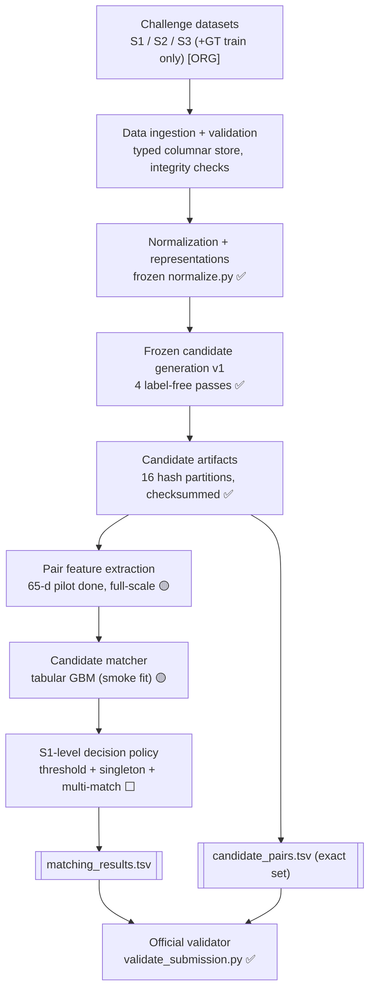

---

## 5. Problem Definition

**Formal statement [ORG].** Given three record sets — S1 (deduplicated reference), S2, and S3 — each
record carrying `entity_id`, `business_name`, `business_address`, `country`, produce for every S1
entity *e* the set `M(e) ⊆ (S2 ∪ S3)` of records denoting the same real-world business. `M(e)` may be
empty (singleton), a single record, or many records spanning both S2 and S3. This is **one-to-many,
cross-source entity resolution** — not deduplication (S1 is already deduplicated) and not 1:1 linkage
(mean **3.46** matches/S1, max **11**; `candidate_refinement_report.md`, `integrity_report.md`).

**Objective [ORG].** Maximize `macro-F₀.₅ = mean over S1 of F₀.₅(e)`, where per entity
`F₀.₅(e) = (1.25·P(e)·R(e)) / (0.25·P(e) + R(e))`, `P(e)=|pred∩truth|/|pred|`, `R(e)=|pred∩truth|/|truth|`.
Edge cases fixed by spec: **empty truth ∧ empty pred = 1.0**; **any non-empty pred on empty truth = 0.0**;
β=0.5 ⇒ a false merge costs ≈**2×** a miss. The spec worked example evaluates to **0.714**
(reproduced by frozen `evaluate.py`, §18).

**Why the metric shapes the whole design [PDD].** Because precision dominates and a true singleton is
worth a full 1.0 only when left empty, the system is engineered to be **conservative at the decision
boundary** (§17) and to treat the singleton path as first-class, not an afterthought. Because
`candidate_pairs.tsv` is *also* graded on tightness (O12), the blocking stage cannot over-retrieve to
protect recall without a size penalty — recall and candidate-size are co-optimized, not traded freely.

**Decomposition [PDD].** The problem factors into three separable sub-problems, each with its own
evaluation layer (§12, §18):
1. **Retrieval / blocking** — bound `M(e)` inside a small candidate set `C(e)`; measured by *pair
   recall* and *candidate size*. (FROZEN, §11.)
2. **Pairwise scoring** — for each `(e, c), c ∈ C(e)`, estimate `P(match)`; measured by pair
   precision/recall on held-out labels. (🟡 piloted — smoke matcher fit; full-scale ⬜)
3. **Entity decision** — turn per-pair scores into `M(e)` under the F₀.₅ objective, including the
   singleton call; measured by end-to-end macro-F₀.₅. (⬜)

**Hard invariant [ORG]:** `M(e) ⊆ C(e)` for every *e* (O13). The decision stage may only *filter*
candidates; it can never introduce an ID absent from `candidate_pairs.tsv`. This makes retrieval pair
recall (**0.878084**, §11) a **hard upper bound** on achievable recall, and the candidate oracle
(**macro-F₀.₅ ≈ 0.9486**, §12) a **hard upper bound** on achievable score for this frozen candidate set.

---

## 6. System Goals and Non-Goals

**Goals [PDD unless tagged].**
- **G1.** Maximize held-out macro-F₀.₅ under the precision-heavy β=0.5 regime **[ORG objective]**.
- **G2.** Emit two validator-clean TSVs where `matches ⊆ candidates` and `candidate_pairs.tsv` is the
  *exact* set the matcher scored **[ORG O10–O16]**.
- **G3.** Keep per-S1 candidate sets tight (smaller ranks higher) without sacrificing the frozen recall
  ceiling **[ORG O12]** — achieved p99 **213**, max **292** (§11).
- **G4.** Generalize zero-shot to **France** (unseen country) — country enters only as an *agreement*
  signal, never one-hot **[ORG O9]**.
- **G5.** Run end-to-end within a **~0.8 GB free-RAM** planning budget at 2M+ S1 / 5M+ S2 / 5M+ S3
  scale via out-of-core execution **[ENG]** (measured peaks §19).
- **G6.** Be fully reproducible from `code/` with pinned versions, fixed seeds, and SHA-256 manifests
  **[ORG O23]**.
- **G7.** Preserve a hard **leakage firewall** between matcher training and evaluation splits **[PDD]**.

**Non-Goals.**
- **N1.** *No* external business-identity lookup, enrichment, geocoding, registry, or commercial ER API
  — **disqualifying** **[ORG O22]**. The frozen policy asserts `label_use = all false`.
- **N2.** *No* LLM as the final matcher; the model envelope is MIT/Apache-2.0, ≤8B params, satisfied by
  a tabular GBM **[ORG O20]**.
- **N3.** *No* top-1 / 1:1 assignment — the task is one-to-many; forcing a single best match is
  structurally wrong (76.8% match multiple within one source) **[ORG O3, data]**.
- **N4.** *No* redesign or regeneration of candidate policy v1 — it is a **frozen upstream contract**
  (§11) **[PDD]**.
- **N5.** *No* optimization against a public leaderboard signal; trust the held-out
  `model_final_eval` split **[PDD]**.
- **N6.** *No* hard-coding of the {US, India} country set; treat country as an open set **[ORG O9]**.

**Design tension explicitly accepted [PDD].** The frozen candidate recall of **0.878084** caps recall:
~12.2% of true links (**93,134** of 763,919 dev GT links) are unreachable by any downstream matcher.
This is a deliberate recall-for-precision-and-size trade (§11–§12): the F₀.₅ objective rewards it, and
the oracle shows the ceiling is still **0.9486**, far above the recall figure — recall loss does not
translate 1:1 into score loss because most missed links are on entities that still match other records.

---

## 7. Data Architecture

**Sources and scale [ORG facts, profiled].** Two disjoint partitions — **train** (labelled) and
**test** (unlabelled) — each with three record sets (`integrity_report.md`):

| Partition | S1 | S2 | S3 | Countries |
|---|---|---|---|---|
| train | 2,206,821 | 5,034,616 | 5,285,603 | {US, India} |
| test | 1,732,544 | 4,887,273 | 5,082,316 | {US, India, **France**} |

Test S1 country breakdown: India **809,986** / US **663,106** / France **259,452** (~15% France, **zero
training rows** — the open-set challenge, O9). Ground truth exists **train-only**: 7,638,365 matched
pairs, avg **3.461**/S1, max **11**, singletons **123,247 (5.6%)**; target rows S3- **3,944,746** /
S2- **3,693,619**.

**Storage strategy [ENG/PDD].** The dominant constraint is **~0.8 GB free RAM** against ~5M-row string
tables. Therefore:
- Ingest TSV → **typed columnar Parquet** once; never `pd.read_csv` a full 5M-row string table into RAM.
- **Integer-code entity IDs** for joins; keep the string ID only for final emission.
- Big joins run in **DuckDB** with a bounded `memory_limit` and a `temp_directory` so hash joins/sorts
  **spill to disk**; scans use **polars streaming/lazy**.
- Candidate materialization is **partitioned into 16 shards** by `hash(source1_entity_id) % 16` so no
  stage holds the full 34.6M-row candidate table in memory.

**Data integrity guarantees [verified — `integrity_check.py`, `integrity_report.md`].**
- `entity_id` unique within every file; S2/S3 id namespaces **disjoint**.
- Every GT id resolves in-source (**0 missing**); **0** duplicate S1 GT rows; **0** intra-list dup ids.
- **Each S2/S3 record matches ≤1 S1** (cross-S1 sharing = **0**) → splitting on S1 partitions the labels
  with **no target leakage** (the firewall in §13 depends on this fact).
- `business_name` never empty (0); empty `business_address` S2 ≈ **3.36%** / S3 ≈ **3.33%** (the ~3% in O8).

**Diagram D2 — Data ingestion and integrity flow:**

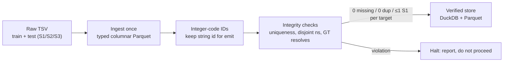

---

## 8. Data Schemas

**Record schema [ORG O5].** All six input files share one schema; TSV with a header row.

| Column | Type | Notes |
|---|---|---|
| `entity_id` | string | Prefixed `S1-` / `S2-` / `S3-` (O6); unique within file; **not stripped** by validator |
| `business_name` | string | Never empty (verified); noisy: translit, accents, suffixes, junk, domains |
| `business_address` | string | ~3% empty in S2/S3; free-form |
| `country` | string | Open set; train {US, India}, test adds France |

**Ground-truth schema [ORG O7] (train only).**

| Column | Type | Notes |
|---|---|---|
| `source1_entity_id` | string | One row per train S1; the reference key |
| `matched_entity_ids` | string | Comma-joined S2-/S3- ids; **empty ⇒ singleton** |

**Output schemas [ORG O10/O11] — validator-exact.**

| File | Header (real TABs) | Row semantics |
|---|---|---|
| `output/matching_results.tsv` | `source1_entity_id⇥matched_entity_ids` | one row per **test** S1; empty field = singleton |
| `output/candidate_pairs.tsv` | `source1_entity_id⇥candidate_entity_ids` | the **exact** last-stage candidate set fed to the matcher |

**Format invariants the validator enforces [ORG O14/O15] (breaking any = rejection):**
- Real TAB field separator; comma-joined lists with **no space after commas**.
- S1 key and IDs are **not stripped** → emit **no** leading/trailing whitespace.
- Lists contain only S2-/S3- ids; **no** S1 self-matches; **no** duplicate id in a list; **no**
  duplicate S1 rows; **every** test S1 present; **no** id absent from the test set.

**Internal schemas [PDD] (not organizer-facing).**
- **Candidate artifact** (frozen): `(source1_entity_id, candidate_entity_id, provenance_bitmask,
  evidence_score)` across 16 hash-partitioned Parquet parts; **34,568,979** rows total (§11).
- **Feature matrix** (🟡 contract only, §14): `(pair_key, 65 numeric features, [train-only label])`,
  float32-compact.
- **Split table** (✅): `split_s1.parquet` (dev split) + matcher-split assignment (§13).

---

## 9. Normalization Architecture

**Status: ✅ Existing, FROZEN.** `code/.../normalize.py`, SHA-256 `b3508b60…` (pinned in
`final_candidate_policy_manifest.json` as a frozen input). Because candidate generation is frozen on
top of it, normalization is itself immutable — any change would invalidate the candidate artifact's
identity checksum (§11).

**Purpose [PDD].** Collapse the O8 noise classes into stable comparison keys **using only deterministic,
local, stdlib algorithms** — satisfying fair-play (O22): normalization *transforms* text, it never
*looks up* a business.

**Transform pipeline [PDD/EXP].** Applied to `business_name` and `business_address`:
1. **Unicode fold** — `unicodedata` NFKD + accent stripping (France accents; O8). Stdlib only.
2. **Transliteration bridge** — Devanagari↔Latin handling so India records collide on a common key (O8).
3. **Case / whitespace** — lowercase, collapse runs, strip leading junk (`--`, `<<`), trim.
4. **Punctuation & connective canon** — `&`↔`and`, drop non-alphanumerics to spaces.
5. **Legal-suffix canon** — Pvt/Private, Ltd/Limited, Corp/Corporation, Sarl/SCI, etc. → a canonical
   token or removal, producing a **name-without-suffix** key.
6. **Domain-as-name** — strip URL/domain scaffolding to the core token.
7. **Token & sorted-token keys** — token set, and a **sorted-name** key (word-order-swap invariant).

**Derived keys consumed downstream [PDD].** `country` (agreement only), `name_nosuffix`, `sorted_name`,
`name_token set`, `address_token set`, `exact_address`. These are exactly the keys the four frozen
retrieval passes block on (§10).

**Evidence it works [EXP — `baseline_blocking.md`].** Exact `(country, name_nosuffix)` blocking recovers
only **47.02%** of val true pairs (US 49%, India 44%); the sorted-key variant **50.61%**. Exact-name
blocking is **provably insufficient** — this measured gap is the justification for the four-pass fuzzy /
token / address design (§10), which lifts pair recall to **0.878** (§11). The jump **0.47 → 0.88** is
the normalization+retrieval architecture's headline validated result, not an assumption.

**Governance note [ORG].** Nothing here contacts a network, reads an external dataset, or resolves a
real business. All transforms are pure functions of the input string + Python stdlib tables.

---

## 10. Candidate Generation Architecture

**Status: ✅ Existing, FROZEN (design described here; policy numbers in §11).** Label-free by
construction — `label_use = all false` in the policy manifest, satisfying O22.

**Four retrieval passes [EXP — `candidate_experiment_summary.md`].** Each pass blocks S2∪S3 targets to
each S1 on a different key, then results are unioned and deduplicated. Single-pass val recall:

| Pass | Key | Provenance bit | Single-pass recall |
|---|---|---|---|
| P1 sorted_name | word-order-invariant name key | 1 | 0.5061 |
| P2 exact_address | normalized full address | 2 | 0.0832 |
| P3 name_token | shared name tokens | 4 | 0.5317 |
| P4 address_token | shared address tokens | 8 | 0.7965 |

**Provenance bitmask [PDD].** Each surviving `(S1, target)` pair carries an integer bitmask = OR of the
passes that produced it (`sorted_name=1, exact_address=2, name_token=4, address_token=8`). Dedup is a
bitwise OR over passes, so provenance is preserved without row duplication — and becomes a **feature
group** for the matcher (§14) at zero extra cost.

**IDF-aware evidence ranking [EXP/PDD].** Token passes over-generate on frequent tokens. Each candidate
gets `evidence_score = Σ_{shared tokens t} 1 / target_df(t)` (rare shared tokens weigh more). This score
drives per-S1 pruning (§11). Ranker pinned as `evidence_ranker_v1.json` (SHA `a0fb606f…`); rank shards
`rank_shards` (SHA `e2db9fd4…`, 106,487,165 rows, 128 parts). Cumulative unioned recall before pruning
reaches **0.9425**; the per-pass-capped canonical union sits at **0.8614** (658,063 recovered) — the
*intermediate* figure, distinct from the frozen-final **0.878084** (§11, §33 discrepancy note).

**Diagram D3 — Candidate generation (four passes → union → rank):**

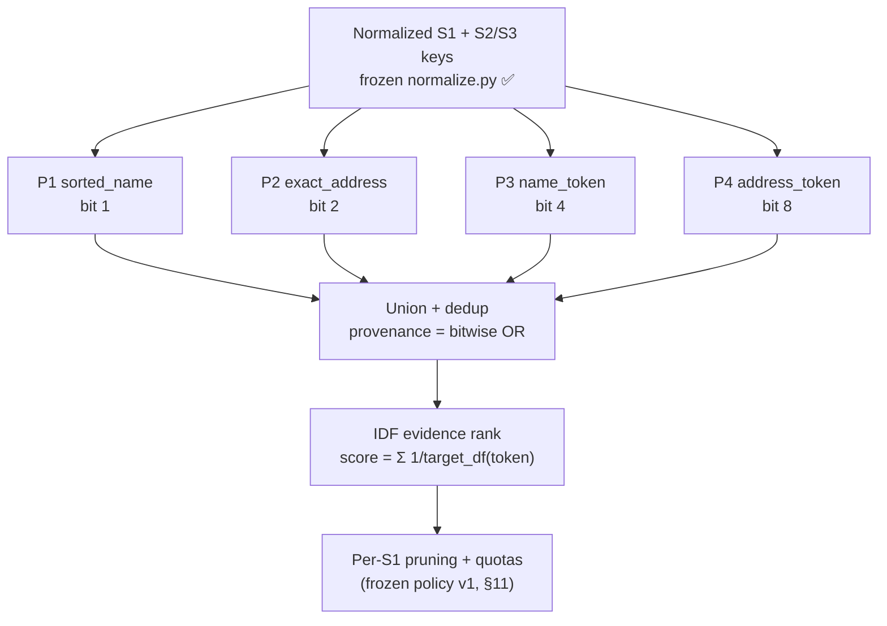

---

## 11. Frozen Candidate Policy v1

**Status: ✅ Existing, FROZEN — immutable upstream contract.** Policy id
**`evidence_source_50_50_heavy100_v1`**; policy SHA `46fd324b…`; freeze gate **passed=true**
(`final_candidate_policy_manifest.json`, `final_candidate_artifact_manifest.json`,
`candidate_refinement_report.md`). **This section is descriptive only. Do NOT redesign, re-tune, or
regenerate it** (§28, §36) — doing so breaks every downstream identity checksum.

**Selection [EXP].** 13 candidate policies were compared in `candidate_refinement_report.md`; the
selected final policy applies, on top of the ranked four-pass union (§10):
- **Source 50/50 quota** — reserve balanced capacity for S2 and S3 targets per S1, so one noisy source
  cannot crowd out the other.
- **Heavy sorted-name cap 100** — cap the sorted-name pass at 100 for "heavy" S1 (blocks ≥120 records),
  taming quadratic blow-up on common names while protecting recall.

**Frozen artifact — the graded `candidate_pairs.tsv` source:**

| Property | Value |
|---|---|
| Candidate rows | **34,568,979** |
| Partitions | **16** by `hash(source1_entity_id) % 16`; partition_manifest_sha256 `221fef24…9465b067` |
| Artifact bytes | 217,174,342 |
| Recovered GT links (dev) | **670,785 / 763,919** |
| **Pair recall (dev)** | **0.878084** |
| S2 recall / S3 recall | 0.881595 / 0.874805 |
| India recall / US recall | 0.875810 / 0.879595 |
| Both-address-present / either-missing | 0.884902 / 0.729202 |
| Candidates/S1 mean | **156.75** |
| Candidates/S1 p99 / max | **213 / 292** (from uncapped p99 755 / max 1537) |
| Zero-candidate S1s | **230** |
| Identity reproduction | **0 added / 0 removed / 0 duplicate**, equal=true |

**Recall discrepancy — reconciled, not hidden [per §36].** Two recall numbers appear in the evidence
and are **both correct for different objects**: **0.8614** (658,063 recovered) is the *intermediate*
"canonical IDF-100 per-pass-capped union" (`candidate_experiment_summary.md`); **0.878084** (670,785
recovered) is the *selected final frozen policy* `evidence_source_50_50_heavy100_v1`
(`candidate_refinement_report.md`). The frozen-final number supersedes the intermediate; they are not
in conflict.

**Recall ceiling consequence [ORG O13].** Because `matches ⊆ candidates`, **0.878084** is a hard recall
ceiling and the **93,134** unreached links (mostly on either-address-missing pairs, recall 0.729) are
permanently out of reach for this policy — a bounded, measured, accepted loss (§6, §12, §32).

---

## 12. Candidate Oracle and Quality Ceiling

**Status: ✅ Existing (`candidate_oracle_report.md`).** The oracle answers one question: *if the matcher
were perfect on the frozen candidate set, what macro-F₀.₅ is achievable?* It labels each candidate with
the ground truth and computes the metric — an **upper bound**, not a live score (O19).

**Ceiling for frozen policy v1:**

| Metric | Value |
|---|---|
| **Oracle macro-F₀.₅** | **0.948629** |
| Mean precision | 0.980357 |
| Mean recall | 0.884090 |
| India / US oracle F₀.₅ | 0.94288 / 0.95244 |

**Interpretation [PDD].** Oracle recall (0.884) exceeds pair recall (0.878) because macro-F₀.₅ is a
per-entity mean: an entity that loses one of several links still scores high, so link-level recall loss
is **sub-linear** in score loss. The **0.9486 ceiling is the number the end-to-end system is measured
against** — the matcher's job (§16–17) is to convert as much of the 0.878→0.9486 headroom into realized
score as precision allows.

**Alternative policies bracket the trade [EXP].** The recall-leaning **75/75** policy raises the ceiling
to **0.952327**; the compact **37/38** policy still holds **0.946593** at a much smaller candidate size.
The frozen 50/50+heavy100 choice sits deliberately between them — near-max ceiling, tight size (O12).
These alternatives are recorded for §32 (future policy v2), **not** grounds to unfreeze v1.

**Four distinct evaluation layers [PDD] — never conflated:**

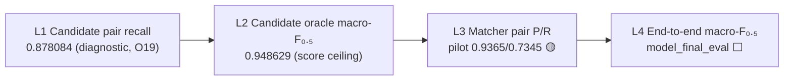

L1/L2 are frozen and known today; a **pilot L3** exists (smoke matcher); **L4 requires the full matcher
and is not computed.** Reporting L1 as if it were L4, or
L4 as if it could exceed L2, is a category error this architecture forbids.

---

## 13. Matcher Split Architecture

**Status: ✅ Existing (`matcher_split_checksums.json`, seed `matcher_split_v1_20260926`).** A hard
**leakage firewall** partitioning the labelled train S1 into four disjoint roles so tuning never
contaminates evaluation (G7).

| Split | S1 count | Role |
|---|---|---|
| `model_train` | **1,765,608** | fit the matcher |
| `model_calibration` | **110,341** | probability calibration + threshold τ tuning |
| `model_final_eval` | **110,341** | **untouched** held-out end-to-end macro-F₀.₅ |
| `candidate_dev` | **220,531** | candidate-policy development (the 0.878 recall split, §11) |

**Assignment mechanism [PDD].** Deterministic `MD5(entity_id ‖ seed) → bucket`, so the split is
reproducible from the id alone and stable across machines. Verified overlap: **cross-split S1 overlap =
0**; **labelled-target overlap = 0**.

**Why S1-partitioning is leak-safe [verified fact, §7].** Because **each S2/S3 target matches ≤1 S1**
(cross-S1 sharing = 0), partitioning on S1 also partitions the labelled targets — a target seen in
`model_train` cannot reappear as a label in `model_final_eval`. This is the structural property that
makes the firewall real, not nominal.

**Honest scope of the firewall [per §36 — `foundation_gate_summary.md` correction].** Id-uniqueness
prevents **target-record** leakage; it does **not** prevent **feature-distribution** leakage: **55,627**
name-keys are shared across splits, and **46.31%** of val S1 share a name-key with train. Therefore the
grouped-key holdout is a **stress-test diagnostic**, not a guaranteed lower bound on generalization. This
correction is recorded so no future session mistakes "no target leakage" for "no leakage of any kind."

**Distribution preserved [EXP].** Each split retains mean_links ≈ **3.46**, the singleton rate, and the
US/India country mix (per-split stats in the checksums file), so calibration and eval see the true
match-count distribution.

**Diagram D4 — Split / leakage firewall:**

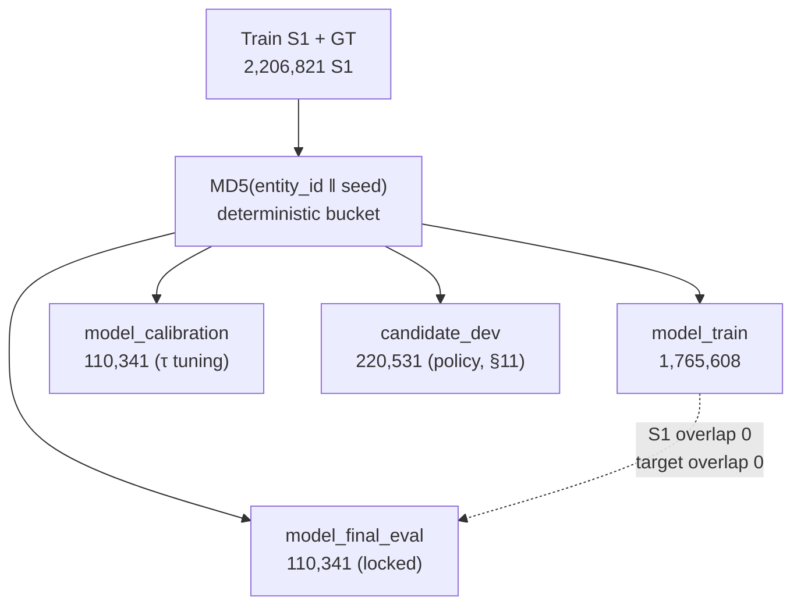

---

## 14. Feature Architecture

**Status: 🟡 In progress — pilot computed, full-scale materialization underway.** `feature_spec_v1`
defines **65 label-free numeric features** in **7 groups**. The matrix is **no longer a scaffold**: a
**pilot 65-d matrix has been computed** (`feature_pilot_audit.json`: **1,098,300 candidate rows**,
added/removed/dup **0/0/0**, null **0**, nan/inf **0**, positives 21,186 / negatives 1,077,114) and
persisted (`feature_pilot_v1_final/*.parquet`, split by country). **Full-scale feature materialization
over the model-development splits is actively running** (`model_development_features/`: `model_fit` and
`baseline_dev` base features complete; "extra" features complete for India, US in a `.partial.parquet`
at last inspection). This is a **discrepancy correction** from the earlier draft, which stated "no
feature matrix has been computed" — see §36. Full production matrix over all 34,568,979 candidates is
still pending; **no test-set features exist** and `model_final_eval` remains firewalled (§13).

| # | Group | What it captures | Source |
|---|---|---|---|
| 1 | **provenance** | which of the 4 passes fired (bitmask decomposition, evidence_score, rank) | §10 bitmask |
| 2 | **exact** | exact-key agreements (name_nosuffix, sorted_name, full address) | normalize keys |
| 3 | **missing_length** | address-missing flags, name/address lengths, length ratios | raw fields |
| 4 | **token** | shared-token counts, Jaccard, IDF-weighted overlap, coverage | token sets |
| 5 | **numeric** | shared digit sequences (street numbers, unit ids) | address digits |
| 6 | **fuzzy** | rapidfuzz ratios (token_sort, token_set, partial) on name/address | rapidfuzz |
| 7 | **script** | writing-system agreement (Latin/Devanagari), transliteration-bridge flags | unicode class |

**Design constraints [PDD].**
- **Label-free features only** — every feature is a pure function of the two records + corpus DF stats;
  no feature peeks at GT (fair-play O22, and prevents trivial leakage).
- **Country as agreement, not identity [ORG O9]** — a boolean `country_match`, never a one-hot of
  {US, India}. This is what lets the model transfer zero-shot to France: France pairs still produce a
  `country_match` signal even though no France row was ever trained on.
- **Missing-aware [O8]** — `either_address_missing` is explicit; it is the feature most correlated with
  the recall cliff (0.729 vs 0.885, §11), so the matcher must see it rather than infer it.
- **Compact dtypes [ENG]** — float32 / small ints; the matrix is built per hash-partition and streamed,
  never fully resident (§19).

**Diagram D5 — Feature extraction (pair → 65-d vector):**

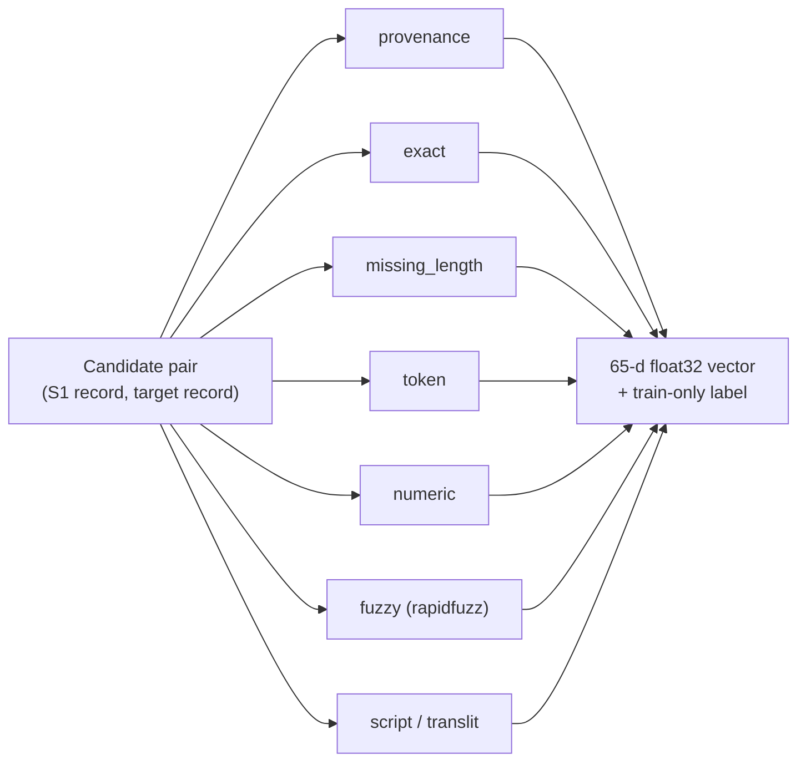

---

## 15. Negative Sampling Architecture

**Status: 🟡 Pilot sampler built and run; full-scale pending.** A negative sampler **exists and has been
executed at pilot scale**, producing three checksummed policy artifacts (`negative_samples/`):
`hard.parquet` (113,411 rows, 15,072 pos / 98,339 neg, SHA `b97d10a0…`), `random.parquet`
(113,411 rows, SHA `8d3a65b5…`), and **`hybrid_source_balanced.parquet` — SELECTED** (113,367 rows,
15,072 pos / 98,295 neg, SHA `c34c0f65…`). Hard/random use 20 negatives/S1; the selected hybrid uses up
to 10 hard-ranked negatives from **each** target source (S2, S3) to balance provenance. **All recovered
positives are retained in every policy.** This corrects the earlier "no sampler code exists yet" draft
(§36). Full-scale negative sampling over the complete `model_fit` split is pending.

**Core principle [PDD].** **Negatives are drawn only from the frozen candidate set** — never from the
full S2∪S3 cross-product. The matcher's job is to discriminate *within the candidates it will actually
see at inference*, so its training distribution must be the candidate distribution, not an artificial
one.

**Label assignment on candidates [PDD].**
- **Positives** = candidate pairs that are in the ground truth: `GT ∩ candidates`. By construction these
  number **670,785** on the dev split (the recovered links, §11).
- **Hard negatives** = high-similarity candidate pairs that are **not** in GT (high fuzzy/token overlap,
  low `1/df` distinctiveness) — the pairs the matcher will most easily confuse; kept in full or
  over-weighted.
- **Easy negatives** = low-similarity candidate non-matches — **subsampled** to control class balance
  and matrix size (§19), since they are numerous and cheaply separable.

**Explicit exclusion [PDD, critical].** **Candidate-generation misses are NOT matcher negatives.** A
true link that blocking failed to retrieve (the ~93,134 unreached, §11) is *absent from candidates*, so
it can be neither a positive nor a negative — it is simply outside the matcher's universe. Treating
misses as negatives would teach the model to reject true matches and is forbidden.

**Class-balance policy [EXP-to-be].** Target ratio tuned on `model_calibration` (not `model_final_eval`);
GBMs handle moderate imbalance with `scale_pos_weight`, so the sampler aims for a *bounded* negative
multiple rather than 50/50. Final ratio is an experiment to log (§21), not a fixed assumption.

**Diagram D6 — Negative sampling from candidates:**

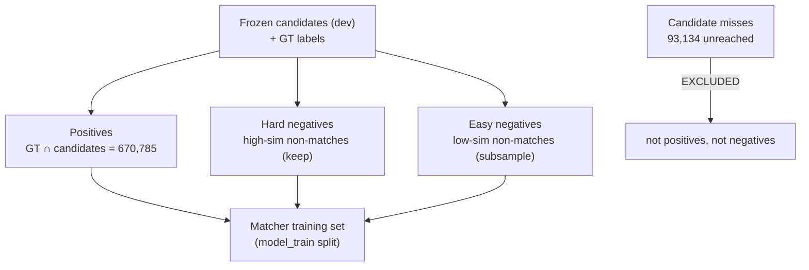

---

## 16. Matcher Architecture

**Status: 🟡 In progress — pilot/smoke matchers fit; full-scale bake-off pending.** Contrary to the
earlier "⬜ Planned / no `.fit`" draft (corrected here per §36), **three matchers have been fit and
thresholded at pilot scale** on the negative-sampled pilot set (113,367 sampled rows, 15,072 positives),
scored on the calibration-dev pilot. These are **pilot/calibration-development numbers only — NOT
leaderboard, NOT an end-to-end L4 score**, and `model_final_eval` was **never touched** (§13, §18):

| Pilot matcher | τ | macro-F₀.₅ | Pair P | Pair R | Notes |
|---|---:|---:|---:|---:|---|
| Deterministic rule | 0.56 | 0.628979 | 0.928970 | 0.426153 | floor / feature sanity check |
| Logistic (linear logit) | 0.93 | 0.781286 | 0.859481 | 0.702334 | fixed-seed **NumPy** logit — Windows app-control blocked scikit-learn's compiled `_cd_fast` DLL |
| **LightGBM smoke** | 0.67 | **0.851852** | 0.936502 | 0.734491 | **one fixed 40-tree / 15-leaf config, no search**; model → `work/lightgbm_smoke_v1.txt` |

These artifacts (`baseline_results.json`, `logistic_baseline_v1.json`, `lightgbm_smoke.json`) confirm the
progression below has been *piloted*, not that the production matcher is selected. **No hyperparameter
search, no full-scale training, no calibration on the full split, and no test inference have run.**

**Model choice [ORG O20 / PDD].** A **tabular gradient-boosted tree** (LightGBM 4.7.0 primary, XGBoost
3.4.1 comparator) over the 65-feature vector (§14). This satisfies the envelope **MIT/Apache-2.0, ≤8B
params** trivially (a GBM is megabytes, not billions of params) and is **explicitly not an LLM** — the
brief says an LLM is not the default, and a GBM is the right tool for dense low-dimensional tabular
signal at hundreds-of-millions-of-pairs scale (O21).

**Empirical progression [PDD — compare before choosing, per working rules].**
1. **Deterministic rule baseline** — thresholded exact/fuzzy agreement; establishes a floor and sanity-
   checks features.
2. **Logistic regression** — calibrated linear baseline; cheap, interpretable, catches feature bugs.
3. **GBM (LightGBM / XGBoost)** — the intended production matcher; selected only if it beats the
   baselines on `model_calibration` by evidence, not assumption.

**Output [PDD].** Per candidate pair, a **calibrated `P(match) ∈ [0,1]`** — **not** a forced top-1. This
is mandatory: 76.8% of S1 match multiple records in one source (O3, data), so any argmax/1:1 assignment
structurally caps recall. Calibration (isotonic/Platt on `model_calibration`) makes the probability
comparable across entities so a single global threshold τ (§17) is meaningful.

**Scale execution [ENG O21].** Inference runs **per hash-partition** (16 shards): load one partition's
feature matrix, score, write `P(match)`, release. Peak RSS stays bounded (§19); batched scoring, float32
throughout.

**Model card at selection [ORG].** When the production model is chosen, a card records: family, license,
param count, features, calibration method, `model_final_eval` macro-F₀.₅, and the deterministic seed —
the O20/O23 compliance record. A **pilot smoke model** exists (`work/lightgbm_smoke_v1.txt`, 40 trees);
the **production card is not written yet** because no model has been selected and `model_final_eval` is
firewalled.

**Diagram D7 — Matcher (candidate → calibrated probability):**

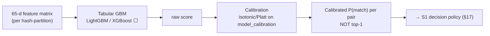

---

## 17. Entity-Level Decision Architecture

**Status: ⬜ Planned.** Converts per-pair `P(match)` (§16) into the final per-S1 match set `M(e)` under
the F₀.₅ objective. This is where the precision-heavy metric is actually *won or lost*.

**Threshold policy [PDD].** A single **global, calibrated threshold τ**, tuned on `model_calibration` to
maximize macro-F₀.₅, then **locked** before touching `model_final_eval`. Because β=0.5 weights precision
≈2× recall, the optimum τ is **deliberately high** — the system prefers to drop a marginal candidate
than risk a false merge.

**Per-candidate keep/drop [ORG O2/O3].** For each S1, keep **every** candidate with `P(match) ≥ τ` — zero,
one, or many, spanning S2 and S3 freely. **No argmax, no per-source cap at decision time.** The one-to-
many structure is honored by thresholding, not ranking.

**Singleton path [ORG O4 — first-class].** If **no** candidate clears τ, emit an **empty** match set. A
correct empty prediction scores a full **1.0**; a single false positive on a true singleton scores
**0.0**. With 5.6% true singletons, the empty path is a direct, high-leverage contributor to macro-F₀.₅
— it is engineered explicitly, not left to fall out of thresholding.

**Multi-match refinement [PDD/FUT].** Optional post-threshold logic to be validated on
`model_calibration` only: e.g., a light per-S1 consistency check when accepted candidates disagree
strongly. Any such rule ships **only** if it lifts held-out macro-F₀.₅; otherwise plain thresholding
stands.

**Hard invariant [ORG O13].** The decision stage may only **filter** candidates. `M(e) ⊆ C(e)` always;
it can never emit an id absent from `candidate_pairs.tsv`. This guarantees the submission's
matches-⊆-candidates check passes by construction.

**Diagram D8 — S1-level decision:**

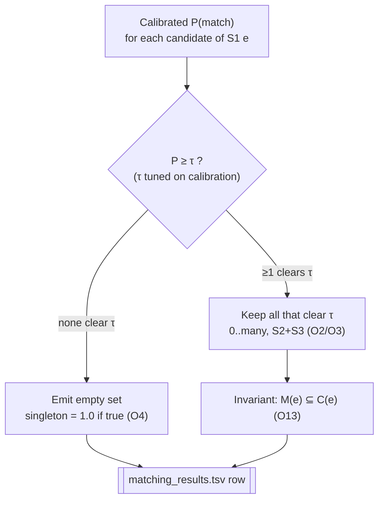

---

## 18. Evaluation Architecture

**Status: ✅ Existing, FROZEN.** `code/.../evaluate.py`, SHA-256 `e99d7f0a…` (pinned frozen input). It
implements macro-F₀.₅ **exactly** per O17/O18 and **reproduces the spec worked example → 0.714**, which
is the correctness gate for the whole scoring stack.

**What it computes [ORG O17/O18].** Per S1: `P = |pred∩truth|/|pred|`, `R = |pred∩truth|/|truth|`,
`F₀.₅ = (1.25·P·R)/(0.25·P+R)`; then the **macro-average** over all S1. Edge cases hard-coded: empty
truth ∧ empty pred = **1.0**; non-empty pred on empty truth = **0.0**; empty pred on non-empty truth =
0.0.

**Four evaluation layers, four purposes [PDD — §12]:**

| Layer | Question | Number today | Uses labels? |
|---|---|---|---|
| L1 candidate pair recall | did blocking retrieve the true links? | **0.878084** | dev GT (diagnostic, O19) |
| L2 candidate oracle F₀.₅ | best possible score on this candidate set? | **0.948629** | dev GT (ceiling) |
| L3 matcher pair P/R | is the classifier accurate per pair? | 🟡 **pilot** (GBM-smoke P 0.9365 / R 0.7345) | pilot calibration-dev GT |
| L4 end-to-end macro-F₀.₅ | the actual leaderboard-shaped score | ⬜ | `model_final_eval` (locked) |

**Pilot L3 exists; L4 does not [per §36].** The smoke matcher produced **pilot** pair P/R and per-entity
macro-F₀.₅ (0.851852) on the **calibration-development** pilot — an L3-type diagnostic, explicitly **not**
L4. `model_final_eval` was never scored.

**Discipline [ORG O19 / PDD].** L1 is a **diagnostic, not the score** — recall ≠ leaderboard. Only **L4
on `model_final_eval`** is the honest estimate of competition performance, and it is reported **once**,
after τ is locked, to avoid overfitting the eval split (§13). Only a **pilot L3** diagnostic exists; **no
L4 number exists yet and none is claimed** (§36).

**Country-wise + open-set reporting [ORG O9].** Evaluation is sliced by country. For the **France**
zero-shot path, planned **leave-one-country-out (LOCO)** probes train on {US} or {India} and evaluate on
the held-out country as a proxy for France generalization (⬜, §25). Today only candidate-layer country
recall is known (India 0.8758 / US 0.8796, §11).

**Release gate [ORG O16].** Separately from scoring, `validate_submission.py` (§26) is the format gate;
a run is release-eligible only when it prints **PASS** *and* the L4 estimate is recorded.

---

## 19. Resource and Scalability Architecture

**Dominant constraint [ENG].** ~**0.8 GB free RAM** against ~5M-row string tables and **hundreds of
millions** of candidate pairs pre-prune (O21). Every stage is designed out-of-core.

**Out-of-core techniques [ENG].**
- **DuckDB** for big joins with a bounded `memory_limit` + `temp_directory` → hash joins/sorts **spill
  to disk** rather than OOM.
- **polars streaming/lazy** scans; **pyarrow** Parquet as the on-disk columnar format.
- **Integer-coded IDs**, **float32 / small-int** feature dtypes, **scipy sparse** where applicable.
- **16 hash partitions** (`hash(source1_entity_id) % 16`) so no stage materializes the full 34.6M-row
  candidate table; features and inference run **per shard**.
- **Atomic `.partial` writes** + **per-part SHA-256** → restart/resume without corruption (§20).

**Measured memory — reported honestly, NOT conflated [per §36].** Distinct operations have distinct
peaks; none should be described as "comfortable":

| Operation | Peak RSS | Note |
|---|---|---|
| Production candidate reproduction | ≈ **648.5 MiB** | temp spill 0, exit 0, identity 0/0/0 (§11) |
| Foundation steps | 600–680 MiB | ingest/normalize/split |
| Full candidate_generation audit (full materialization) | ≈ **1.27 GiB** | DuckDB spill enabled |
| Projected full-scale test inference | < **1.1 GiB** | projection, ⬜ not yet measured |

**Discrepancy surfaced [per §36].** The audit peak (**≈1.27 GiB**) and projected inference (**<1.1 GiB**)
**exceed the ~0.8 GB planning budget**. They complete only because DuckDB spills to disk; the budget is a
*resident* target, not a hard ceiling on peak. This is a real risk for full-scale test inference (§27)
and must be validated, not assumed away.

**A prior "137 MB" claim was corrected [per §36 — `foundation_gate_summary.md`]** to the true process
peak ≈**600–680 MiB**; the smaller figure measured only a sub-step, not the process.

**Diagram D9 — Resource / partition strategy:**

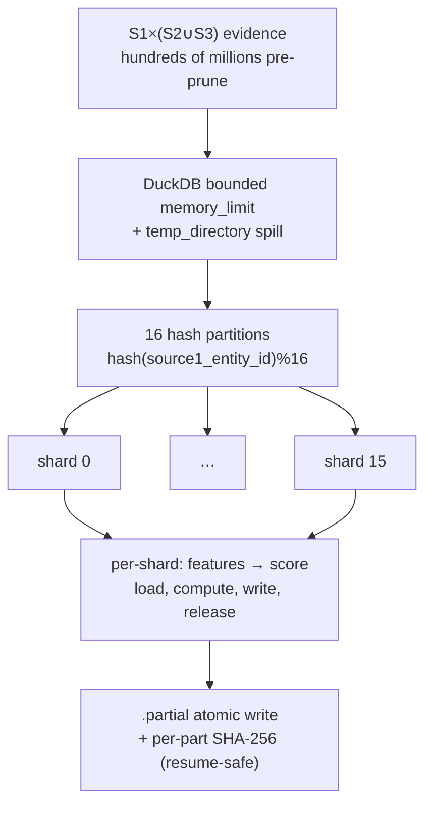

---

## 20. Reproducibility Architecture

**Status: ✅ Existing for frozen stages.** Reproducibility is enforced by **content-addressed
manifests**, fixed seeds, and pinned versions — the O23 compliance mechanism.

**Manifest chain [PDD].** Every frozen artifact pins the SHA-256 of its inputs *and* its outputs, so the
whole candidate stage is verifiable end-to-end:
- `final_candidate_policy_manifest.json` — pins **normalize.py** `b3508b60…`, **evaluate.py** `e99d7f0a…`,
  `split_s1.parquet` `d01e4811…` (2,206,821 rows), `evidence_ranker_v1.json` `a0fb606f…`, `rank_shards`
  `e2db9fd4…` (106,487,165 rows / 128 parts); policy `46fd324b…`.
- `final_candidate_artifact_manifest.json` — 16 parts (part-00…15) with per-part rows/bytes/sha256;
  row_count **34,568,979**; partition_manifest_sha256 `221fef24…9465b067`.
- `matcher_split_checksums.json` — split seed `matcher_split_v1_20260926`, per-split counts + `entity_id_sha256`.

**Freeze gate [PDD].** Regenerating the candidate artifact and diffing identities yields **0 added / 0
removed / 0 duplicate**, `equal=true` → freeze gate **passed**. This is the objective proof the artifact
is reproducible bit-for-bit from `code/`, and the reason it may be treated as an immutable contract
(§11).

**Determinism controls [PDD/ENG].**
- **Fixed seeds** — candidate-dev split seed 42; matcher split seed `matcher_split_v1_20260926`; model
  seeds to be pinned at training (⬜).
- **Pinned versions** — `requirements.txt` pins numpy 2.5.3 / pandas 3.0.6 / scikit-learn 1.9.1 /
  rapidfuzz 3.14.6 / lightgbm 4.7.0 / xgboost 3.4.1 / polars 1.44.2 / pyarrow 25.0.1 / duckdb 1.5.5.
- **Deterministic hashing** — `MD5(entity_id‖seed)` splits and `hash()%16` partitions reproduce identically.
- **Runtime** — `.venv` Python **3.12** (system 3.14 lacks wheels); `PYTHONUTF8=1`;
  `sys.stdout.reconfigure(utf-8, replace)` in every script (Windows UTF-8 safety).

**Reproduction command [ORG O23].** The policy manifest carries the exact regeneration command; running
it must reproduce the checksum `221fef24…9465b067`. Experiment tracking (§21) is append-only, so any run
is auditable after the fact.

**Diagram D10 — Reproducibility / artifact chain:**

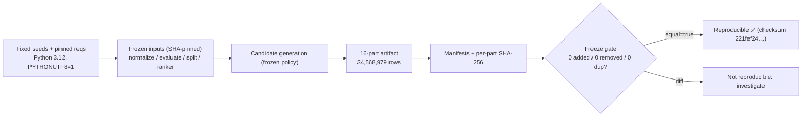

---

## 21. Experiment Tracking

**Status: ✅ Existing (append-only ledger) + ✅ narrative reports.** Every measured claim in this
document traces to a logged run, per the working rule *measure, never assume*.

**Ledger [PDD].** `work/ledger.duckdb` — an **append-only** DuckDB store of runs: policy/experiment id,
inputs (with SHA), metrics (recall, size, reduction-ratio, oracle F₀.₅, runtime, peak RSS), and outcome.
Append-only so history cannot be silently rewritten to fit a narrative.

**Narrative reports [PDD] — the human-readable evidence trail:**

| Report | What it fixes as evidence |
|---|---|
| `integrity_report.md` | dataset scale, GT distribution, referential integrity (§7) |
| `baseline_blocking.md` | exact-block recall 0.4702 / sorted 0.5061 (§9 justification) |
| `candidate_experiment_summary.md` | single-pass + cumulative recall; intermediate 0.8614 (§10) |
| `candidate_refinement_report.md` | 13 policies; selected 0.878084 / 34.6M (§11) |
| `candidate_oracle_report.md` | ceiling 0.948629 + alternatives (§12) |
| `foundation_gate_summary.md` | **corrections**: memory ~600–680 MiB; leakage scope (§13, §19) |

**Why not MLflow [PDD].** A hosted tracker adds a service dependency and RAM overhead for no benefit at
this scale; a checksummed append-only DuckDB ledger + committed markdown reports give full auditability
within the memory budget and the "runnable from `code/`" constraint (O23). Recorded as a deliberate
decision (ADR-011, §29), revisitable if the team grows.

**Discipline encoded [PDD].** A claim enters this architecture only with a citable run; corrections
(the two in `foundation_gate_summary.md`) are logged as first-class events, not edits — so "137 MB→
600–680 MiB" and the leakage-scope re-scoping are part of the permanent record (§36).

---

## 22. Repository Architecture

**Principle [ORG O23].** Everything needed to reproduce the submission lives under `code/`; `work/`
holds manifests/reports/ledger; `dataset/` and `output/` are data in/out. Status markers reflect
**actual** repo evidence (§31), not intent.

| Path | Role | Status |
|---|---|---|
| `code/.../normalize.py` | frozen deterministic normalization (SHA `b3508b60…`) | ✅ |
| `code/.../evaluate.py` | frozen macro-F₀.₅ evaluator (SHA `e99d7f0a…`, →0.714) | ✅ |
| `code/.../split.py` | candidate-dev split (seed 42) + matcher split v1 | ✅ |
| `code/.../materialize.py` | 16-partition candidate materialization (out-of-core) | ✅ |
| `matcher/` split tables + firewall; pilot matchers (`lightgbm_smoke_v1.txt`, logistic, deterministic) fit | pilot done; full-scale ⬜ | 🟡 |
| feature extraction | `feature_spec_v1` 65-d; pilot matrix computed (1,098,300 rows, audit 0/0/0); full-scale materialization running | 🟡 |
| negative sampler | candidate-only sampling; 3 policies run (`negative_samples/*.parquet`), `hybrid_source_balanced` selected | 🟡 |
| S1 decision policy | threshold + singleton + multi-match | ⬜ |
| submission assembler | emits the two TSVs, exact format | ⬜ |
| `utils/validate_submission.py` | official format gate (→PASS) | ✅ |
| `scripts/integrity_check.py`, `scripts/profile_dataset.py` | profiling/integrity | ✅ |
| `work/*.json`, `work/*.md`, `work/ledger.duckdb` | manifests, reports, experiment ledger | ✅ |
| `dataset/{train,test}/` | inputs (S1/S2/S3 [+GT train]) | ✅ (data) |
| `output/` | `matching_results.tsv`, `candidate_pairs.tsv` | **⬜ empty** |

**CLI surface [PDD].** A single `er` entrypoint with subcommands mirrors the pipeline stages:
`split | analyze-gt | block | features | train | predict | evaluate | submit | validate`. Stages
`split`/`block` are backed by existing code; `features`/`train`/`predict`/`submit` are the planned
modules above.

**Module boundaries [PDD].** The three hard concerns — **candidate generation** (frozen), **pairwise
scoring**, **entity decision** — are separate modules with separate manifests and separate evaluation
layers (§12/§18), so freezing one does not entangle the others. This is what lets policy v1 be immutable
while the matcher is still unbuilt.

---

## 23. Technology Stack

All libraries are permissive-licensed (MIT/BSD/Apache), satisfying O20 for the shipped stack. Versions
are pinned (§20). Status = whether the component is *actively used today* (✅) or *reserved for a planned
stage* (⬜).

| Layer | Technology | Role | Why Used | Status |
|---|---|---|---|---|
| Runtime | Python **3.12** (`.venv`) | interpreter | system 3.14 lacks wheels; 3.12 has all binaries | ✅ |
| Normalization | **stdlib `unicodedata`** | deterministic folding/translit | fair-play: transform, never look up (O22) | ✅ |
| Columnar store | **pyarrow 25.0.1** / Parquet | typed on-disk store | avoids loading 5M-row string tables into RAM | ✅ |
| Out-of-core SQL | **duckdb 1.5.5** | big joins, spill to disk | joins hundreds of M pairs under 0.8 GB budget (O21) | ✅ |
| DataFrame | **polars 1.44.2** | streaming/lazy scans | low-memory columnar ops | ✅ |
| Fuzzy strings | **rapidfuzz 3.14.6** | token_sort/set/partial ratios | fast C++ fuzzy features (§14 fuzzy group) | 🟡 (contract) |
| Numerics | **numpy 2.5.3 / scipy 1.18.1** | arrays, sparse matrices | compact dtypes, sparse overlap | ✅ / 🟡 |
| GBM (primary) | **lightgbm 4.7.0** | tabular matcher | ≤8B, fast, MIT; not an LLM (O20) | 🟡 smoke fit (`lightgbm_smoke_v1.txt`) |
| GBM (comparator) | **xgboost 3.4.1** | matcher comparison | empirical model bake-off | ⬜ |
| Calibration/LR | **scikit-learn 1.9.1** | logistic baseline, isotonic/Platt | calibrated P(match), baselines (§16) | ⚠️ compiled `_cd_fast` DLL blocked by Windows app-control; pilot LR ran via fixed-seed NumPy logit |
| Experiment log | **duckdb** (`work/ledger.duckdb`) | append-only run ledger | auditable, no service dependency (§21) | ✅ |
| Validation | `utils/validate_submission.py` | official format gate | O16 PASS gate | ✅ |
| Docs/diagrams | **mermaid-cli (mmdc) 12.0.0**, **node 24.19.0** | render diagrams → PNG, md → PDF | local, no external service (§26 build) | ✅ (tooling) |

**Deliberately excluded [PDD].** No deep-learning framework, no vector DB, no hosted tracker, **no LLM**
in the scored pipeline — each would add memory/latency/licensing/fair-play risk without evidence of
benefit at this scale. `pandas 3.0.6` is available but **not** used for full-table string loads (ENG
rule); DuckDB/polars handle scale.

---

## 24. End-to-End Implementation Plan

Phases with status from **actual repo evidence** (§31); COMPLETED requires a verified artifact.
Traceable to `ULTRA_PLAN.md` (Phases 0–18) and `IMPLEMENTATION_PLAN.md` (ER-001…ER-032, a backlog with
no done-markers).

| Phase | Work | Status | Evidence |
|---|---|---|---|
| 0 | Environment, pinned deps, UTF-8 harness | **COMPLETED** | `.venv` 3.12, `requirements.txt` |
| 1 | Ingest + profile + integrity | **COMPLETED** | `integrity_report.md` (0 violations) |
| 2 | Frozen normalization | **COMPLETED** | `normalize.py` SHA `b3508b60…` |
| 3 | Frozen evaluator (→0.714) | **COMPLETED** | `evaluate.py` SHA `e99d7f0a…` |
| 4 | Baseline blocking (recall 0.47) | **COMPLETED** | `baseline_blocking.md` |
| 5 | Four-pass retrieval + IDF rank | **COMPLETED** | `candidate_experiment_summary.md` |
| 6 | Policy refinement + **freeze v1** | **COMPLETED** | `candidate_refinement_report.md`, freeze gate |
| 7 | Candidate oracle ceiling | **COMPLETED** | `candidate_oracle_report.md` (0.9486) |
| 7b | Matcher split + firewall | **COMPLETED** | `matcher_split_checksums.json` (overlap 0) |
| 8 | **Feature matrix computation** (65-d) | **PILOT DONE / full-scale IN PROGRESS** | pilot 1,098,300 rows (audit 0/0/0); `model_development_features/` materializing 🟡 |
| 9 | Negative sampling from candidates | **PILOT DONE** | 3 policies run; `hybrid_source_balanced` selected 🟡 |
| 10 | Matcher bake-off (rule→LR→GBM) | **PILOT/SMOKE DONE / full-scale NEXT** | pilot fits 0.629/0.781/0.852; no search yet 🟡 |
| 11 | Calibration + threshold τ tuning | **NEXT** | on `baseline_dev`/`model_tune`/`model_threshold` ⬜ |
| 12 | S1 decision policy (singleton/multi) | **NEXT** | ⬜ |
| 13 | LOCO / France zero-shot probes | **FUTURE** | §25 ⬜ |
| 14 | Full-scale test inference (per shard) | **FUTURE** | memory risk §27 ⬜ |
| 15 | Submission assembly (two TSVs) | **FUTURE** | `output/` empty ⬜ |
| 16 | Validate → PASS + final L4 report | **FUTURE** | gate §26 ⬜ |

**Critical path now [PDD].** Phase 8 (feature computation) unblocks 9→10→11→12; only after a τ is locked
on `model_calibration` do Phases 13–16 run. **No phase ≥8 may touch `model_final_eval`** except the
single final L4 read (§13/§18).

**Diagram D11 — Training pipeline (build-time):**

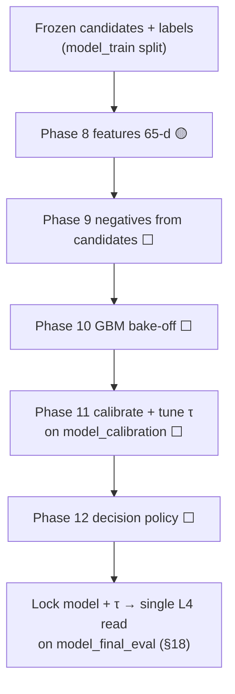

---

## 25. Final Production Pipeline

**Status: ⬜ Planned** (frozen stages ✅ feed it). This is the **test-time** path that produces the two
submission files for the **1,732,544** test S1 (incl. **259,452** France).

**Steps [PDD].**
1. **Ingest + normalize test** — same frozen `normalize.py` (✅) on test S1/S2/S3; identical keys.
2. **Candidate generation on test** — apply the **frozen policy v1** (§11) to produce test candidates,
   16 hash partitions. `candidate_pairs.tsv` is written **directly from this exact set** (O11/O13).
3. **Feature extraction** — 65-d vectors per candidate, per shard (§14, Phase 8).
4. **Matcher scoring** — locked GBM → calibrated `P(match)` per candidate, per shard (§16).
5. **Decision** — global locked τ; keep-all-≥τ; empty-set singleton path (§17).
6. **Assemble** — emit `matching_results.tsv` (`M(e) ⊆ C(e)`) and `candidate_pairs.tsv`; exact format (§26).
7. **Validate** — `validate_submission.py` must print **PASS** (§26, O16).

**France zero-shot handling [ORG O9 / PDD].** No code path special-cases France. It generalizes because:
(a) normalization is country-agnostic (accent-fold covers France, §9); (b) candidate generation is
label-free and key-based, so France blocks like any country; (c) the matcher sees **`country_match` as
agreement**, never a {US, India} one-hot, so a France pair is in-distribution for the features even
though no France row was trained on. **LOCO probes** (Phase 13) estimate the generalization gap before
trusting the France slice.

**Inference resource note [ENG/§27].** Step 4 is the memory-risk stage (projected <1.1 GiB vs 0.8 GiB
budget, §19); it runs strictly **per shard** with release-between-shards and DuckDB spill, and must be
**measured** at full scale before the final run — not assumed.

**Diagram D12 — Test / inference pipeline (produces both TSVs):**

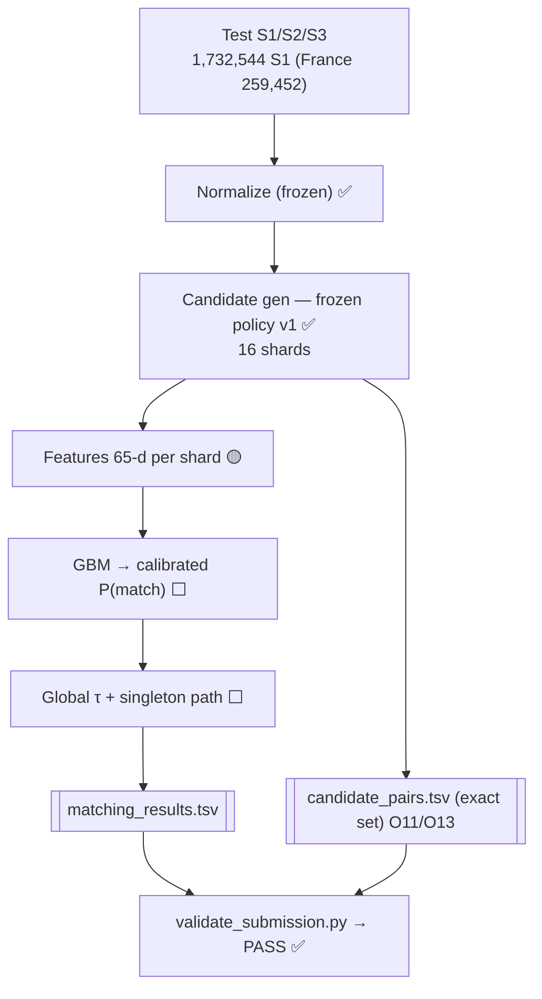

---

## 26. Submission Architecture

**Status: assembler ⬜ / validator ✅.** Two files, both graded (O10–O13), both format-gated (O14–O16).

**Exact output contract [ORG].**
- `output/matching_results.tsv` — header `source1_entity_id⇥matched_entity_ids` (real TAB); **one row
  per test S1**; empty field = singleton.
- `output/candidate_pairs.tsv` — header `source1_entity_id⇥candidate_entity_ids`; the **exact** frozen
  candidate set the matcher scored (§11/§25).

**Writer rules the assembler must obey [ORG O14/O15] (any breach = rejection):**
- Real TAB separator; comma-joined lists with **no space after commas**.
- **No leading/trailing whitespace** on the S1 key or ids (validator does not strip).
- Only S2-/S3- ids; no S1 self-match; no duplicate id in a list; no duplicate S1 row; **every** test S1
  present; no id absent from the test set.
- `M(e) ⊆ C(e)` for every row (O13) — guaranteed because decision only filters candidates (§17).

**Release gate [ORG O16].**

```bash
.venv/Scripts/python utils/validate_submission.py --matching output/matching_results.tsv --candidate output/candidate_pairs.tsv --test-dir dataset/test
```

Must print **PASS**. A run is release-eligible only when the validator passes **and** the L4
`model_final_eval` macro-F₀.₅ is recorded (§18).

**Diagram D13 — Submission / validation:**

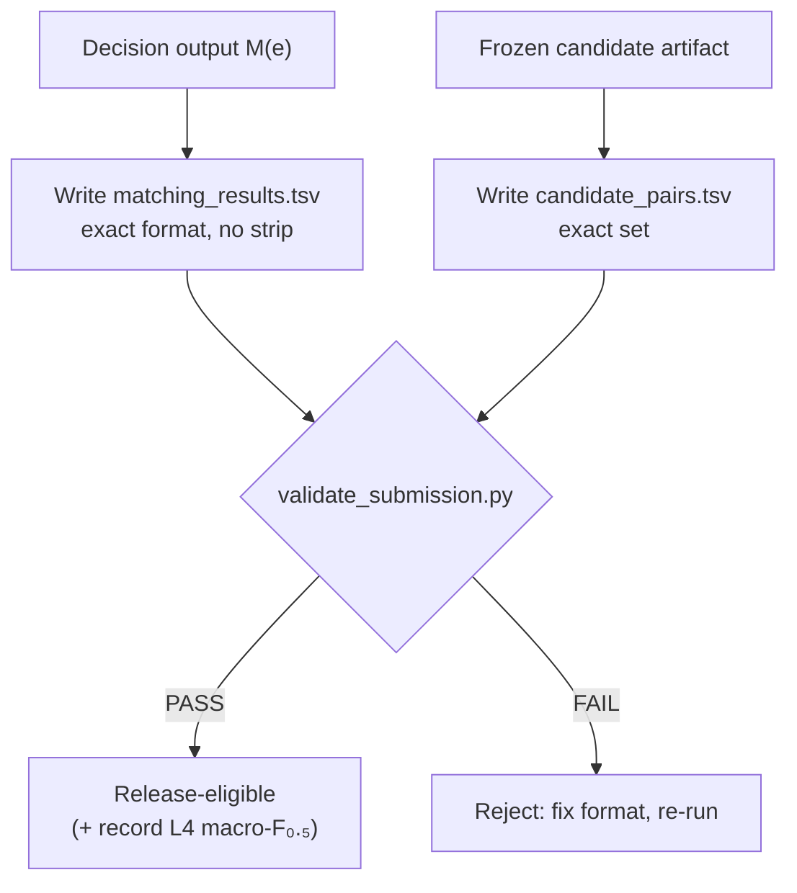

---

## 27. Failure Modes and Safeguards

| Failure Mode | Detection | Prevention | Recovery |
|---|---|---|---|
| **OOM at full-scale inference** (peak >0.8 GB budget; §19) | RSS monitor per shard; DuckDB spill counter | 16-shard per-partition processing; bounded `memory_limit`+`temp_directory`; float32 | resume from last `.partial` shard; shrink shard/batch; add spill |
| **False merge** (β=0.5 costs ≈2×) | precision on `model_calibration`; per-S1 F₀.₅ | high τ; precision-weighted tuning; hard-negative training (§15) | raise τ; re-tune on calibration only |
| **Over-predicting on true singletons** (→0.0) | singleton-slice F₀.₅ | first-class empty path; conservative τ (§17) | raise τ; audit singleton false-positives |
| **Candidate recall ceiling** (12.2% links unreachable; §11) | oracle vs recall layers (§12) | accepted, bounded trade; not fixable without unfreezing v1 | policy v2 experiment (§32) — never edit v1 |
| **France zero-shot collapse** (0 train rows; O9) | LOCO probes (Phase 13) | country-agnostic normalize; agreement-only country feature | fall back to deterministic-rule matcher for France slice |
| **Split leakage** (feature-distribution, not target; §13) | cross-split name-key audit (55,627 shared) | S1-partition (target-safe); grouped-key stress test | report as diagnostic; discount optimistic val |
| **Submission format rejection** (O14/O15) | `validate_submission.py` → FAIL | exact-format writer; no strip; subset check | fix writer; re-validate before release |
| **Matches ⊄ candidates** (O13 breach) | validator subset check | decision only filters candidates (§17 invariant) | drop offending ids; re-emit |
| **Non-reproducible artifact** (O23) | freeze gate identity diff | SHA-pinned manifests; fixed seeds; pinned reqs | regenerate from `code/`; diff to `221fef24…` |
| **Fair-play violation** (external lookup; O22) | code review; `label_use=false` assertion | stdlib-only normalize; no network in pipeline | remove offending path; **disqualifying if shipped** |
| **Eval-split overfitting** | single locked L4 read | τ tuned only on calibration; `model_final_eval` locked | never re-tune against final eval |

**Standing safeguard [PDD/§28].** The frozen stages (normalize, evaluate, candidate policy v1, splits)
are checksum-guarded; any accidental edit is caught by a manifest mismatch **before** it can propagate
into a submission.

---

## 28. Security / Data Governance Constraints

**Fair-play is the top governance rule [ORG O22 — disqualifying].** Learning comes **only** from the
provided data. Prohibited and absent from every code path: external business-identity lookup,
enrichment, commercial ER APIs, government/business registries, geocoding APIs, external company
datasets, any internet-based entity enrichment. **Permitted:** deterministic local normalization via
stdlib `unicodedata`. The distinction is enforced conceptually and asserted in the policy manifest
(`label_use = all false`); transforming a string is allowed, **resolving a real business is not**.

**No network in the scored pipeline [PDD].** The candidate→feature→matcher→decision→submit path makes no
outbound calls. Web access is reserved for **generic technical documentation only**, never to
resolve/enrich a business.

**Label governance [PDD/§13].** Ground truth exists train-only. The matcher-split firewall ensures GT
touches `model_train`/`model_calibration` for fitting/tuning and reaches `model_final_eval` **once** for
the honest estimate. **Test labels are never accessed** (there are none to access) and **no full-scale
test inference has been run** (§31/§37).

**Immutability governance [PDD/§20].** Frozen inputs (normalize `b3508b60…`, evaluate `e99d7f0a…`, split
`d01e4811…`, ranker `a0fb606f…`) and the candidate artifact (`221fef24…9465b067`) are SHA-pinned. Editing
any of them **must** be caught by a manifest mismatch; freezing exists precisely so a later session
cannot silently alter the contract (§36).

**Secrets / PII [ENG].** The data is business names/addresses, not credentials; no `.env`/secret files
are read by the pipeline. Business text is handled as data, emitted only into the two output TSVs.

**Model licensing [ORG O20].** Only MIT/Apache-2.0, ≤8B components ship. The tabular GBM plan and every
listed library (§23) comply; an LLM is excluded from the scored pipeline.

**Reproducibility-as-governance [ORG O23].** Because the whole frozen stage is content-addressed and the
ledger is append-only, any reviewer can independently verify that what ran is what is documented — the
integrity guarantee behind every number in this document.

---

## 29. Architecture Decision Records

Each ADR: **Context / Decision / Alternatives / Consequences / Evidence-status.**

**ADR-001 — Retrieve-then-score with a hard frozen boundary.**
- *Context:* one-to-many ER over 2M+×10M+ records under 0.8 GB RAM; blocking is separately graded (O12).
- *Decision:* three separated concerns — frozen candidate generation → pairwise matcher → S1 decision —
  each with its own manifest and evaluation layer.
- *Alternatives:* monolithic end-to-end learned matcher; single-stage rules.
- *Consequences:* candidate stage can be frozen/immutable while the matcher is still unbuilt; clean
  freeze gates; slight duplication of key logic across stages.
- *Evidence:* **Strong** — freeze gate passed, four eval layers operational (§11/§12).

**ADR-002 — Freeze candidate policy v1 as an immutable upstream contract.**
- *Context:* candidate set is a graded deliverable and the recall ceiling for everything downstream.
- *Decision:* freeze `evidence_source_50_50_heavy100_v1` (34,568,979 rows, recall 0.878084) and forbid
  edits; downstream builds against its checksum.
- *Alternatives:* keep candidates fluid until the matcher exists; co-optimize blocking+matching jointly.
- *Consequences:* stable target for feature/matcher work; reproducible; **caps recall at 0.878** (bounded
  loss, §6/§11); improvements require a *new* policy v2, never an edit.
- *Evidence:* **Strong** — identity reproduction 0/0/0, `equal=true`.

**ADR-003 — Optimize macro-F₀.₅ directly, precision-first.**
- *Context:* β=0.5 ⇒ precision ≈2× recall; correct singleton = 1.0; false merge = 0.0.
- *Decision:* high locked τ, precision-weighted tuning, first-class singleton path.
- *Alternatives:* F₁-style balance; recall-max blocking then aggressive keep.
- *Consequences:* conservative predictions; singleton accuracy directly lifts score; some recall
  deliberately foregone.
- *Evidence:* **Strong (metric)** — `evaluate.py` reproduces spec 0.714; τ tuning ⬜.

**ADR-004 — Country as an agreement feature, never a one-hot.**
- *Context:* test adds France with **0** training rows (open set, O9).
- *Decision:* single `country_match` boolean; no {US, India} encoding anywhere.
- *Alternatives:* one-hot country; per-country models.
- *Consequences:* France pairs stay in-distribution zero-shot; slightly less country-specific signal.
- *Evidence:* **Medium** — design enforced; LOCO/France probes ⬜ (§25).

**ADR-005 — Tabular GBM as the matcher, not an LLM.**
- *Context:* O20 caps the model at MIT/Apache-2.0, ≤8B, LLM-not-default; signal is dense low-dim tabular.
- *Decision:* LightGBM primary, XGBoost comparator, over 65 features; LR + rule baselines first.
- *Alternatives:* fine-tuned small LLM; deep tabular nets; pure rules.
- *Consequences:* megabyte-scale model, fast per-shard inference under budget, trivially compliant;
  needs good hand-designed features.
- *Evidence:* **Medium** — envelope fit certain; a **pilot LightGBM-smoke fit exists** (macro-F₀.₅ 0.851852 on the calibration-dev pilot, `lightgbm_smoke.json`), but the production bake-off/search is not run (§16, §36).

**ADR-006 — Per-candidate thresholding, never top-1.**
- *Context:* mean 3.46 matches/S1; 76.8% match multiple within one source (O3).
- *Decision:* keep every candidate with `P(match) ≥ τ`; 0..many; no argmax/1:1.
- *Alternatives:* top-1; per-source top-k.
- *Consequences:* honors one-to-many; requires calibrated cross-entity probabilities.
- *Evidence:* **Strong (structural)** — GT distribution measured (§7); mechanism ⬜.

**ADR-007 — Negatives drawn only from the candidate set.**
- *Context:* matcher only ever sees candidates at inference; misses are outside its universe.
- *Decision:* positives = GT∩candidates; hard negatives = high-sim non-matches; easy negatives
  subsampled; **candidate misses excluded**.
- *Alternatives:* sample negatives from full cross-product; treat misses as negatives.
- *Consequences:* train distribution = inference distribution; avoids teaching rejection of true matches.
- *Evidence:* **Medium** — design fixed; sampler ⬜ (§15).

**ADR-008 — Leakage firewall by deterministic S1 partition.**
- *Context:* tuning must not contaminate the honest estimate; each S2/S3 target maps to ≤1 S1.
- *Decision:* `MD5(entity_id‖seed)` → {model_train, model_calibration, model_final_eval, candidate_dev};
  `model_final_eval` read once.
- *Alternatives:* random row split; k-fold on pairs.
- *Consequences:* target-leak-free by construction; **does not** remove feature-distribution overlap
  (55,627 shared name-keys) — grouped-key holdout is a stress test, not a bound.
- *Evidence:* **Strong** — overlaps 0/0 verified; leakage-scope correction logged (§13).

**ADR-009 — Out-of-core everything; 16 hash partitions + DuckDB spill.**
- *Context:* ~0.8 GB free RAM vs hundreds of millions of pairs (O21/ENG).
- *Decision:* Parquet columnar, integer IDs, float32, DuckDB `memory_limit`+spill, 16 shards, atomic
  `.partial` + per-part SHA.
- *Alternatives:* in-RAM pandas; a bigger machine (unavailable).
- *Consequences:* fits budget with disk spill; resume-safe; **peaks still exceed 0.8 GB** on full
  materialization (≈1.27 GiB) and projected inference (<1.1 GiB) — must be measured (§19/§27).
- *Evidence:* **Strong (reproduction ≈648.5 MiB, spill 0)** + **flagged risk** at full scale.

**ADR-010 — Deterministic stdlib-only normalization, frozen.**
- *Context:* noise (translit, accents, suffixes, junk) must collapse without any external lookup (O22).
- *Decision:* `unicodedata`-based fold/translit/suffix-canon in `normalize.py`, frozen at `b3508b60…`.
- *Alternatives:* ML transliteration; external name-canonicalization services (**disqualifying**).
- *Consequences:* fair-play-safe, reproducible, lifts recall 0.47→0.88; frozen so candidate identity holds.
- *Evidence:* **Strong** — baseline vs four-pass recall measured (§9/§10).

**ADR-011 — Append-only DuckDB ledger + markdown reports, not MLflow.**
- *Context:* need auditable experiment history within the memory budget and "runnable from `code/`".
- *Decision:* `work/ledger.duckdb` (append-only) + committed narrative reports; no hosted tracker.
- *Alternatives:* MLflow / W&B (service + RAM overhead).
- *Consequences:* zero service dependency, full auditability, corrections logged as events (§21);
  no fancy UI.
- *Evidence:* **Strong** — reports back every number in this document.

**ADR summary map.**

| ADR | Decision | Evidence |
|---|---|---|
| 001 | retrieve-then-score, frozen boundary | Strong |
| 002 | freeze candidate policy v1 | Strong |
| 003 | precision-first macro-F₀.₅ | Strong (metric) / τ ⬜ |
| 004 | country as agreement only | Medium |
| 005 | tabular GBM, no LLM | Medium |
| 006 | per-candidate threshold, no top-1 | Strong (structural) |
| 007 | negatives from candidates only | Medium |
| 008 | S1-partition leakage firewall | Strong |
| 009 | out-of-core, 16 shards + spill | Strong + risk flagged |
| 010 | frozen stdlib normalization | Strong |
| 011 | DuckDB ledger, not MLflow | Strong |

---

## 30. Requirement Traceability Matrix

Full O1–O23 → component → implementation → validation → status. Status reflects §31 evidence.

| # | Organizer Requirement | Source | System Component | Implementation | Validation | Status |
|---|---|---|---|---|---|---|
| O1 | S1 = deduplicated reference | PS | pipeline key, assembler | key on S1; 1 row/S1 | integrity_report (1 GT/S1) | ✅ |
| O2 | 0..many matches per S1 | PS | decision policy | keep-all-≥τ | oracle recovered counts | ⬜ |
| O3 | matches span S2 & S3 | PS | decision policy | no per-source cap | GT 80.5% both | ⬜ |
| O4 | singletons exist | PS | empty path | empty set if none≥τ | evaluator empty/empty=1.0 | ⬜ |
| O5 | record schema | PS/validator | `io.py` | typed columns | integrity_check | ✅ |
| O6 | id prefixes, disjoint ns | PS | id handling | S1/S2/S3, disjoint | integrity (disjoint 0) | ✅ |
| O7 | GT schema (train) | PS | GT loader | comma-join, empty=singleton | 0 dup GT rows | ✅ |
| O8 | noise classes | PS | `normalize.py` (frozen) | fold/translit/suffix | recall 0.47→0.88 | ✅ |
| O9 | open-set France | PS | country feature; LOCO | agreement only | country_open_set:true; probes ⬜ | 🟡 |
| O10 | matching_results.tsv | validator | assembler | exact header/TAB | validate → PASS | ⬜ |
| O11 | candidate_pairs.tsv = exact set | validator | frozen artifact + writer | write from artifact | validate subset | 🟡 |
| O12 | smaller sets rank higher | PS | policy v1 | 50/50 + heavy100 | p99 213 / max 292 | ✅ |
| O13 | matches ⊆ candidates | validator | decision invariant | filter-only | validator subset check | 🟡 |
| O14 | TAB/no-strip/no-space | validator | writer | exact-format | validator FAIL on breach | ⬜ |
| O15 | list content rules | validator | writer | S2/S3 only, no dup | validator checks | ⬜ |
| O16 | PASS gate | validator | `validate_submission.py` | run gate | manual PASS | ✅ (tool) |
| O17 | macro-F₀.₅ formula | PS | `evaluate.py` (frozen) | per-S1→macro | spec → 0.714 | ✅ |
| O18 | edge cases (1.0/0.0) | PS | `evaluate.py` | hard-coded | spec cases | ✅ |
| O19 | recall ≠ score | PS | 4 eval layers | separated | 0.878 vs 0.9486 vs L4 | ✅ (layers) |
| O20 | ≤8B, MIT/Apache, no LLM | PS | GBM plan (§16) | LightGBM/XGBoost | model card at selection | ⬜ |
| O21 | scale to M rows / 100s M pairs | PS | out-of-core, 16 shards | DuckDB spill | RSS ≈648.5 MiB, spill 0 | ✅ |
| O22 | no external lookup | PS | stdlib normalize; label_use=false | no network | manifest assertions | ✅ |
| O23 | reproducible from code/ | PS | manifests, seeds, pins | SHA-256 chain | freeze gate 0/0/0 | ✅ |

**Legend:** ✅ built+verified · 🟡 partially built (contract/artifact present, computation pending) ·
⬜ planned. PS = problem statement; validator = `validate_submission.py`.

---

## 31. Current Project Status

Status dashboard from **actual repo evidence**. Nothing planned is presented as implemented (§36).

| Component | Status | Evidence | Next Gate |
|---|---|---|---|
| Environment / deps | ✅ Existing | `.venv` 3.12, pinned `requirements.txt` | — |
| Ingest + integrity | ✅ Existing | `integrity_report.md` (0 violations) | — |
| Normalization (frozen) | ✅ Existing | `normalize.py` SHA `b3508b60…` | immutable |
| Evaluator (frozen) | ✅ Existing | `evaluate.py` SHA `e99d7f0a…` → 0.714 | immutable |
| Baseline blocking | ✅ Existing | `baseline_blocking.md` (0.4702 / 0.5061) | — |
| Four-pass retrieval + IDF rank | ✅ Existing | `candidate_experiment_summary.md` (0.8614 interm.) | — |
| **Candidate policy v1 (FROZEN)** | ✅ Existing | 34,568,979 rows, recall **0.878084**, gate 0/0/0 | immutable |
| Candidate oracle ceiling | ✅ Existing | `candidate_oracle_report.md` **0.948629** | — |
| Matcher split + firewall | ✅ Existing | `matcher_split_checksums.json`, overlap 0/0 | protect `model_final_eval` |
| Feature spec (65-d) | 🟡 In progress | pilot matrix computed (1,098,300 rows, 0/0/0); full-scale running | finish materialization (Phase 8) |
| Matcher (`matcher/`) | 🟡 In progress | pilot fits (det/LR/GBM-smoke) + `lightgbm_smoke_v1.txt`; no search | GBM bake-off (Phase 10) |
| Negative sampling | 🟡 In progress | 3 policies run (`negative_samples/*.parquet`); `hybrid_source_balanced` selected | full-split sampling (Phase 9) |
| Calibration + τ | ⬜ Planned | (§17) | tune on calibration (Phase 11) |
| S1 decision policy | ⬜ Planned | (§17) | build (Phase 12) |
| France / LOCO probes | ⬜ Planned | (§25) | probe (Phase 13) |
| Full-scale test inference | ⬜ Planned | memory risk (§19/§27) | measure at scale (Phase 14) |
| Submission assembler | ⬜ Planned | `output/` **empty** | emit two TSVs (Phase 15) |
| Validator | ✅ Existing (tool) | `utils/validate_submission.py` | run → PASS (Phase 16) |

**One-line state.** The **entire label-free retrieval half is built, frozen, and reproducible** (recall
**0.878084**, ceiling **0.9486**). The supervised half has been **piloted end-to-end at smoke scale**
(features 1,098,300 rows, negatives 3 policies, matchers det/LR/GBM-smoke fit) and **full-scale feature
materialization is running**; **full-scale training, calibration, decision policy, test inference, and
the submission assembler are not built** and `output/` is empty. No end-to-end macro-F₀.₅ (L4) exists
yet, and none is claimed; `model_final_eval` is firewalled/untouched.

**Open discrepancies carried forward (per §36):** (1) **Pilot-vs-planned status (NEW, corrected in this
revision):** the earlier draft labelled features/negatives/matcher as "no matrix / no `.fit` / planned",
but the repository shows a **completed pilot/smoke end-to-end** (`feature_pilot_*`, `negative_samples/`,
`baseline_results.json`, `lightgbm_smoke.json`, `lightgbm_smoke_v1.txt`) — status labels were corrected
to 🟡, and the pilot numbers are explicitly **not** leaderboard/L4 (§14/§15/§16). (2) candidate recall
**0.8614 intermediate vs 0.878084 frozen-final** — reconciled as different objects (§11); (3) **memory
budget 0.8 GB vs measured peaks 648.5 MiB / 1.27 GiB / <1.1 GiB** — distinct operations, disk-spill
dependent, flagged as inference risk (§19/§27); (4) prior **"137 MB" → ~600–680 MiB** correction and
**leakage-scope** re-scoping logged (§13/§21).

---

## 32. Future Extensions

All **[FUT]**; none authorizes editing a frozen stage. Each is an experiment to run and log (§21), kept
only on held-out evidence.

- **Candidate policy v2 (new artifact, not an edit) [FUT].** The oracle brackets show a recall-leaning
  **75/75** ceiling of **0.952327** and a compact **37/38** at **0.946593** (§12). A v2 could target the
  either-address-missing cliff (recall **0.729**, §11) — e.g., a phonetic/name-only pass for
  address-missing S1 — and be frozen as its **own** policy for A/B, leaving v1 intact (ADR-002).
- **France zero-shot hardening [FUT/ORG O9].** LOCO probes (train {US} eval {India} and vice-versa) to
  quantify the transfer gap; optionally a deterministic-rule fallback for the France slice if the GBM
  under-generalizes.
- **Blocking recall recovery [FUT].** Targeted passes for the **93,134** unreached links (translit-heavy
  India names, domain-as-name) — measured against candidate-size cost (O12) before adoption.
- **Matcher upgrades [FUT].** Monotonic constraints on similarity features; per-pair uncertainty for a
  smarter decision rule; feature ablation to prune the 65-d set.
- **Decision-policy refinement [FUT].** Per-entity adaptive τ or a light multi-match consistency check —
  only if it beats a single global τ on `model_calibration`.
- **Inference memory validation [FUT/ENG].** Measure full-scale test inference RSS against the 0.8 GB
  budget (projected <1.1 GiB, §19) and tune shard count/batch before the final run.
- **Tracking [FUT].** Revisit MLflow only if the team scales (ADR-011); not needed now.

**Guardrail on all extensions [§36].** Any change that would alter a frozen artifact ships as a **new,
separately-frozen** version with its own manifest and A/B evidence — never as an in-place edit to
normalize.py, evaluate.py, the splits, or candidate policy v1.

---

## 33. Final Architecture Summary

This architecture resolves business entities across three noisy sources under a **precision-heavy
macro-F₀.₅** objective, with **S1 as the deduplicated reference** and **one-to-many, cross-source**
matching as the norm (mean 3.46/S1, 5.6% singletons). It is a disciplined **retrieve-then-score**
pipeline with three separated concerns behind hard boundaries: **frozen label-free candidate generation**
→ **pairwise tabular matcher** → **S1-level decision policy**, feeding the two graded outputs
(`matching_results.tsv`, `candidate_pairs.tsv`) through the official validator.

**What is real today (✅).** Deterministic frozen **normalization** (`b3508b60…`); the frozen
**evaluator** reproducing the spec's **0.714**; the leakage-safe **matcher split** (overlaps 0/0); the
**FROZEN candidate policy v1** — **34,568,979** candidates, pair recall **0.878084**, p99 **213** /
max **292**, reproduced **0/0/0** (checksum `221fef24…9465b067`); the candidate **oracle ceiling
0.948629**; and a **65-feature contract**. The whole label-free retrieval half is built and reproducible.

**What has been piloted (🟡) and what is not yet built (⬜).** A **pilot/smoke end-to-end has run**:
65-feature matrix computed on 1,098,300 pilot candidates (0/0/0), three checksummed negative-sampling
policies (`hybrid_source_balanced` selected), and Deterministic/Logistic/LightGBM-smoke matchers fit and
thresholded (pilot macro-F₀.₅ 0.629/0.781/0.852); full-scale feature materialization is running. **Not
yet built:** full-scale GBM **bake-off/hyperparameter search**, **calibration/threshold** on the full
split, the **decision policy**, **France/LOCO** probes, **full-scale test inference**, and the
**submission assembler** — `output/` is **empty**. `model_final_eval` is **firewalled/untouched** — **no
end-to-end score (L4) exists and none is claimed.**

**Design commitments that make it competition-safe.** Precision-first thresholding and a first-class
singleton path for the F₀.₅ regime; per-candidate keep/drop (never top-1) for one-to-many;
**country-as-agreement** for France zero-shot; **out-of-core** execution (16 shards + DuckDB spill) for
the 0.8 GB budget; **fair-play** by construction (`label_use=false`, stdlib-only normalize, no network);
and **reproducibility** via a SHA-256 manifest chain plus an append-only ledger.

**Honesty ledger (surfaced, not hidden).** Recall **0.8614** (intermediate) vs **0.878084** (frozen-final)
are different objects; the **0.8 GB** budget is a resident target that measured peaks (**648.5 MiB** /
**≈1.27 GiB** audit / **<1.1 GiB** projected inference) can exceed via disk spill — a flagged inference
risk; and two prior claims (**"137 MB"**, **"no leakage by construction"**) were corrected and logged.

**Bottom line.** The retrieval foundation is frozen, measured, and reproducible with a **0.9486** score
ceiling; the remaining work is the supervised scoring-and-decision half, whose contracts, splits, and
guardrails are already fixed so it can be built without disturbing anything frozen upstream.

---

*End of master architecture. Companion artifacts: `amazon_ml_challenge_architecture_diagrams.md` (all
Mermaid diagrams), `amazon_ml_challenge_master_architecture.pdf` (polished render).*
